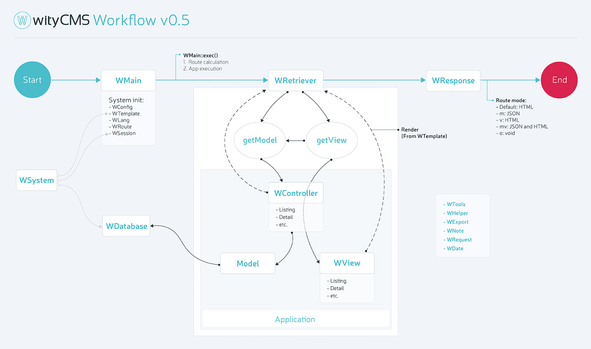

wityCMS is a lightweight Content Management System (CMS) in PHP, Model-View-Controller oriented.

This manual was created for guiding you in your first steps with wityCMS.

1. Overview
2. Getting started
3. Applications
4. Theme
5. Expert
6. Contribution
7. Appendices

We strive to provide an accurate, understandable and user friendly documentation. Your feedback are highly appreciated and will help us to improve our ability to serve you.

Please feel free to leave us your comments using the contact form on the website and subscribe to our newsletter to get the latest news about wityCMS. 

If you need assistance as you go through the questions, you can contact us on [Creatiwity](www.creatiwity.net/contact) or [GitHub](https://github.com/Creatiwity/wityCMS).

# Installer

# Workflow

