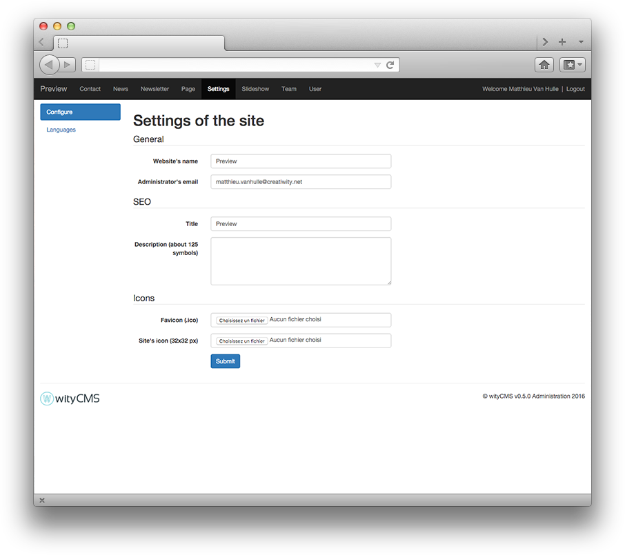

# Administration and Settings

wityCMS comes with an administration panel accessible through the `www.yourwebsite.com/admin` URL. If needed, you will be invited to login (Identifier and password) with your admin account: 

## Dashboard description

Your administration panel is divided into five areas: 

1. The website name which is also a link to the front office
2. The application selector
3. A logout button to disconnect your account
4. The application menu to access to the different sections of your application
5. The content area to edit your **News**, **Pages** etc

## Settings

The **Settings** application will allow you to configure general settings of your website.

### General

*General* - it is the first configuration you did during the installation steps.

* **Website's name**: it is the name you need to give at your website to define your activity.
* **Administrator's Email**: more often, it is better to give the address of the webmaster in charge of the website.

Both fields will be used in the `from` field of the mails sent by the website, like in the contact form.

### SEO

Your Website title defines your activity. Add a short description of your activity (it cannot exceed 125 characters).

### Icons

Edit the icon that will identify your website.

* **favicon (.ico)**: The favicon used in the address bar, bookmarks, tabs, or other shortcuts.
* **Site's Icon (128x128 px)**: Icon used in Facebook publications and iOS shortcuts. 

When finished, you just need to **submit** and your website get the minimal configuration.