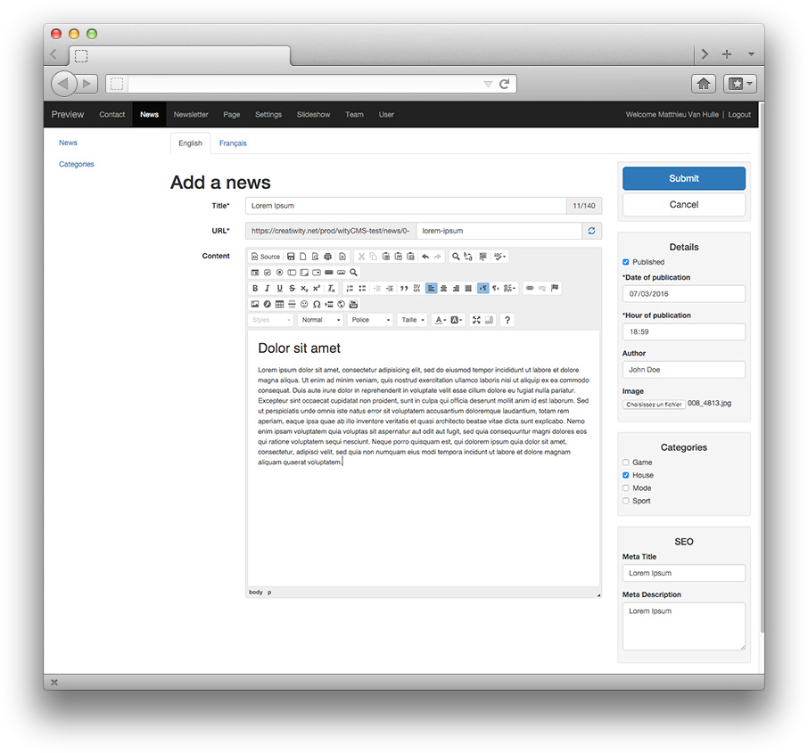
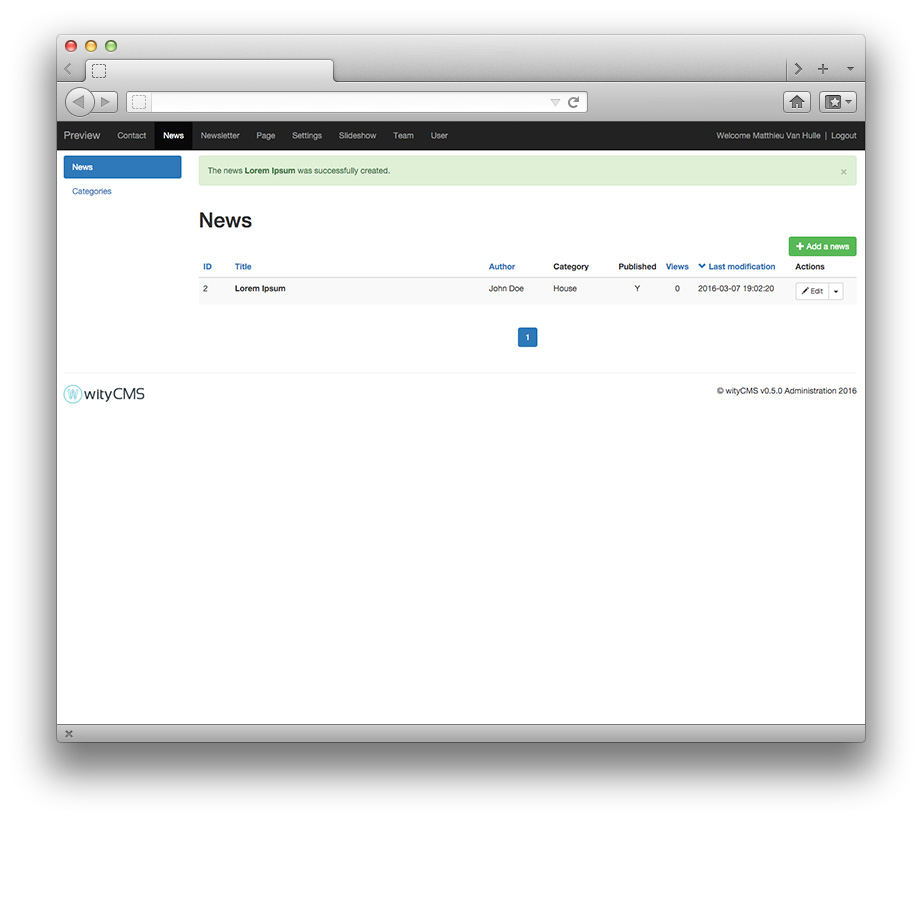

# Admin / Settings

Once you have finished the installation of the website you will access to the back-end (back-office) with the button “**Administration**”. You will be redirect on the identification screen where you need to fill in the form to login.

* Identifier:
* Password:

NB: it is the same nickname and password you filled during the fourth installation step “admin account”.

## Start to post you first news

1. When you are connected to the back-end, click on the "**News**" tab if it is not your default app. 

3. Click on the green button "**Add A news**" and start to write your first *content* for your website

3.  Submit your news

You are notify that "The news **Lorem Ipsum** was successfully created"

4.  Congratulation you added a news for your website, let's see the results on your website. Clic on your "**Site name**" tab (here it's: **Preview**).

Well done ! Now you can edit all your website using the same process. 

