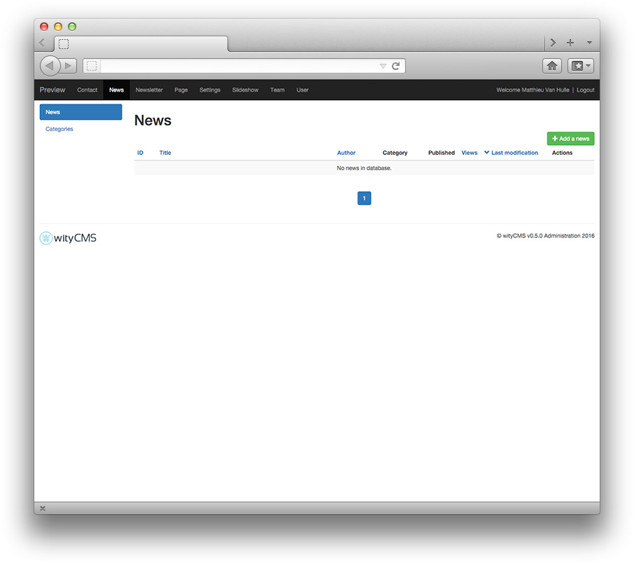
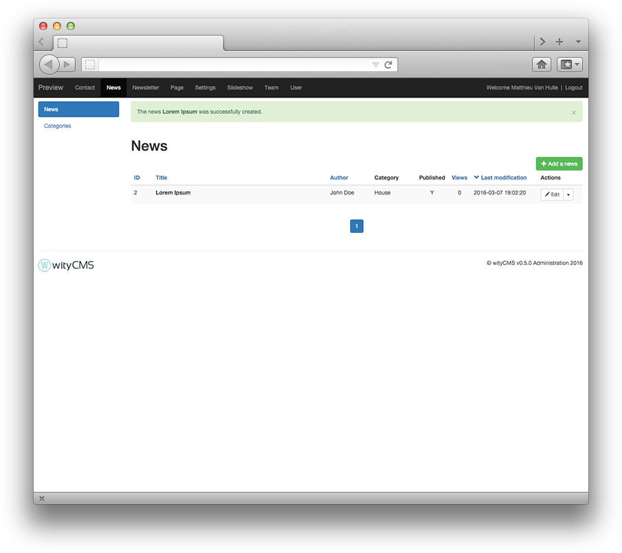

# Administration and Settings

wityCMS comes with administration panel accessible through the www.yourwebsite.com/admin URL. If needed, you will be invited to login (Identifier and password) with your admin account: 

## Start to post you first news

1. When you are connected to the back-end, click on the "**News**" tab (if it is not your default app). 

2. Click on the green button "**Add A news**" and start to write your first *content* for your website

3.  Submit your news

You are notify that "The news **Lorem Ipsum** was successfully created".

4.  Congratulation you added a news for your website, let's see the result on your website. Clic on your "**Site name**" tab (here it's: **Preview**).

Well done ! Now you can set up all your website using the same process. 

