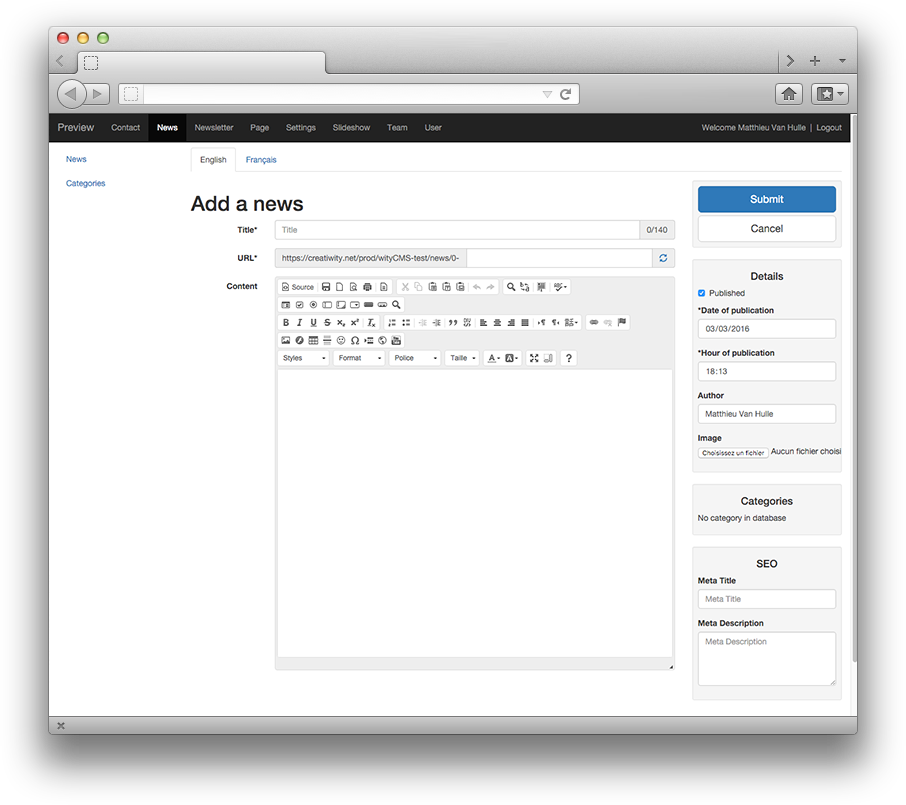

# Admin / Settings

Once you have finished installing your website you will access to administration panel with the button “**Administration**”. You will redirect on identification screen where you need to fill the form to login.

* Identifier: 
* Password:

NB: it’s same nickname and password you fill during the fourth installation step “admin account”.

## 1. Start to post you first news

1. when you are connect, click on the "**New**" tab

2. Click on the green button "**Add A news**" and start to write your first content for your website  

3.  Submit your news

4.  Congratulation you have add a news for your website, let's see it on the front. Clic on your "Site name" tab (here it's: Preview)

5. Congratulation now you can edit all your website using the same process. 

