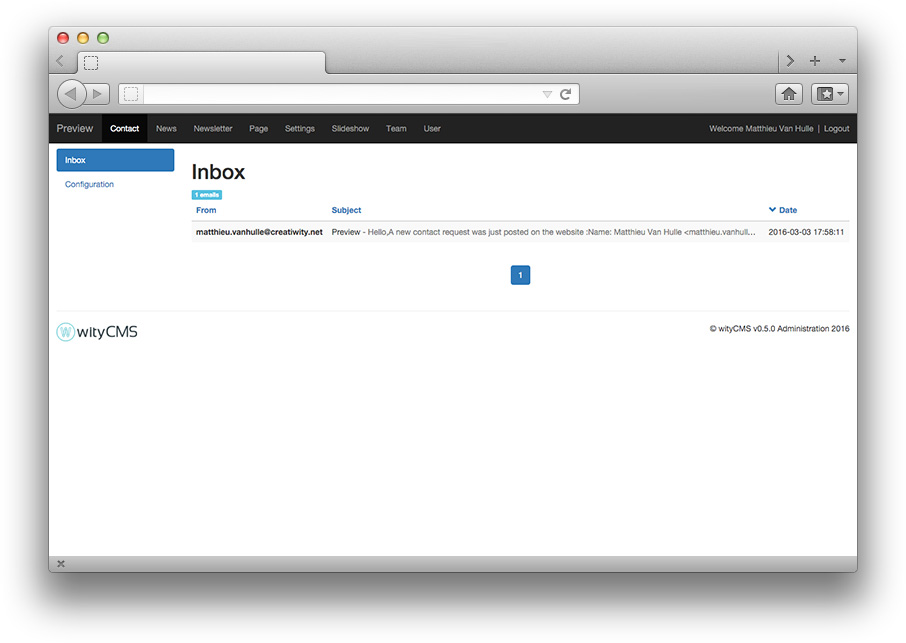
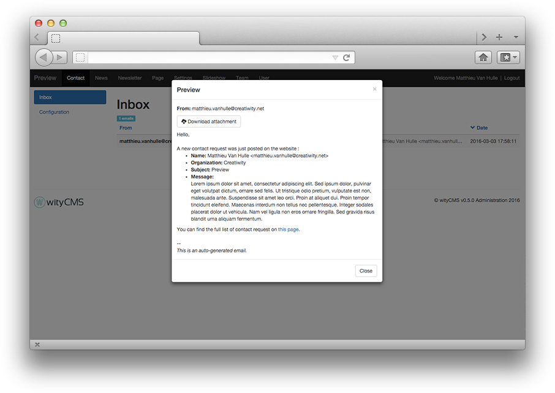

# Contact

The ***contact*** application allows you to manage and receive emails send thanks to the website contact form.

## Contact listing

The list contains all emails sent since the contact form exist.
It gives you a rapid view of:

* **From**: Email address of the person who sent an email
* **Subject**: Title and content
* **Date**: Sending date.

## Reading pop-up

To read a delivery email :

* Click on the message
* A pop-up appear with all the content:
  * Title
  * From
  * Message
  * Attachment

## Configuration

You can also configure a contact box to resend the email contact directly to a configure mail box.

* **Sender's name**: sender's name who receive the mail information
* **Sender's email**: sender's email who receive the mail information
