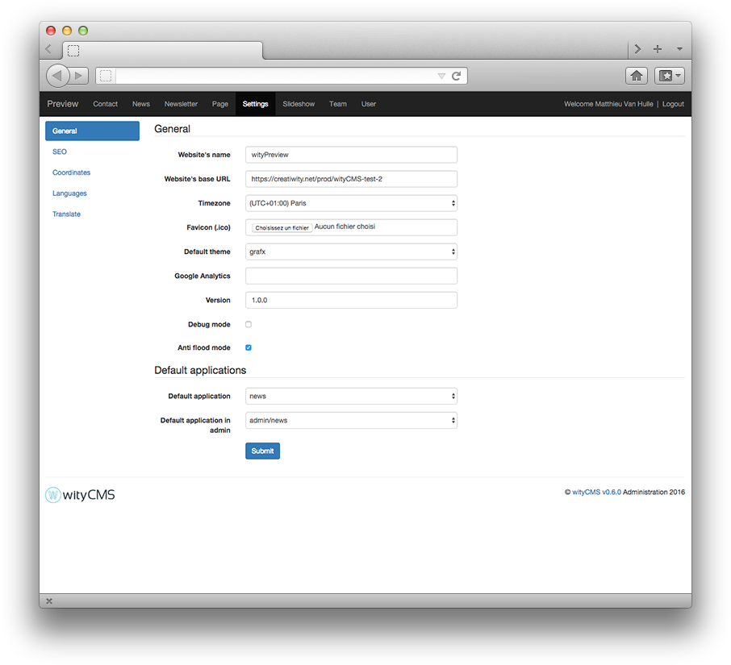
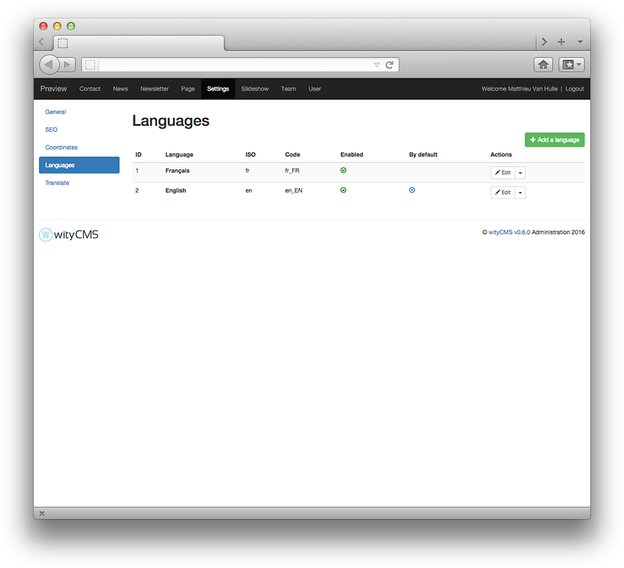
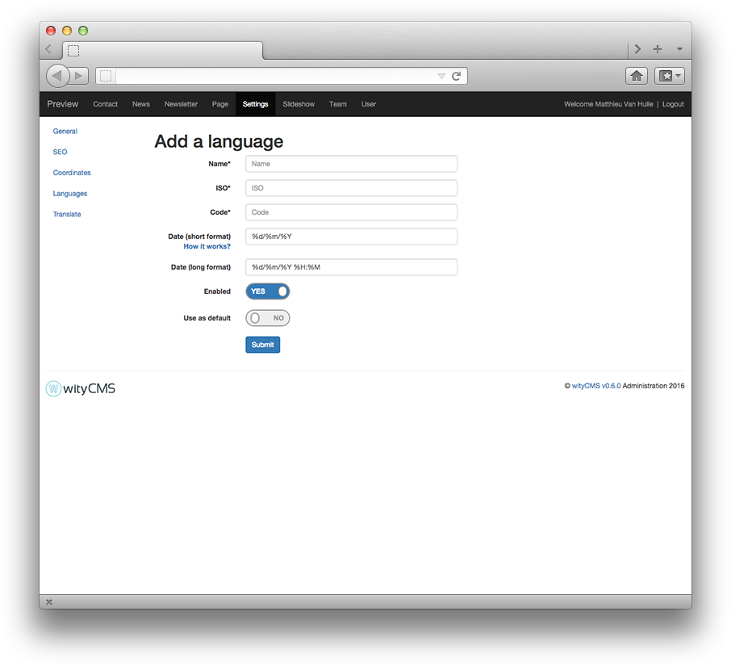
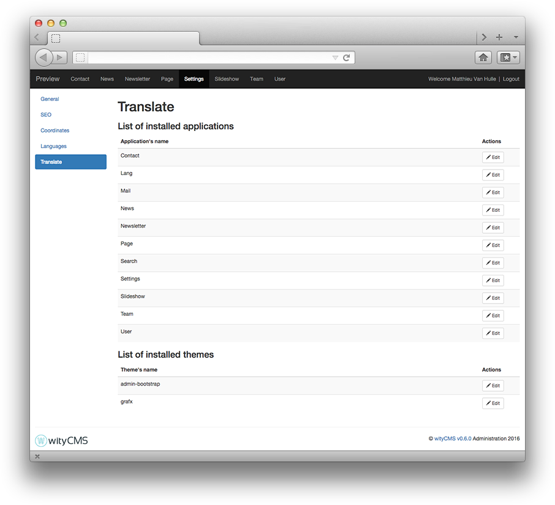
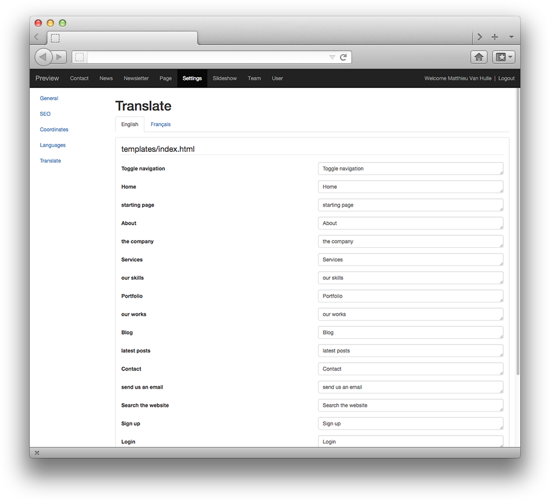

# Settings

The ***Settings*** application will allow you to configure general settings of your website.

## Settings of the site

### General
*General* - it is the main configuration of your website.

* **Website's name**: it is the name you need to give at your website to define your activity.
* **website's base URL**: it is the Uniform Resource Locator who give acces to your website. By default, this field is pre-filled.
* **Time zone***: By default, the Time Zone is always (UTC + 01: 00) Paris.
* **favicon (.ico)**: The favicon used in the address bar, bookmarks, tabs, or other shortcuts. More often, it is the logo of your company or a graphic that represents the activity of your website.
* **Default Theme**: Choose the theme for your website. The field is always pre-filled with the basic theme "grafx".
* **Google Analytics**: 
* **Version**: 
* **Debug mode**:
* **Anti flood mode**:

### Default applications

* **Default application**: The default application is the first application executed by wityCMS. It will be displayed when a visitor connects to the root page of your website. For instance, if you want to create a blog, we advise you to select the ***News*** application.

* **Default application in admin**: The main admin application is the first application loaded when you open the administration. We advise you to select the application you will mainly use (***user*** or ***news*** for instance).

## SEO

### General
This section allows you to edit the elements that will affect the visibility of your website in search engines (such as Google). You can leave the fields below blank, but if you want to be found efficiently on search engines, it is strongly recommended to complete the fields correctly.

* **Title**: Website title which defines your activity.
* **Description (about 125 symbols)**: a short description of your activity (it cannot exceed 125 characters).

### OpenGraph (Facebook)
The OpenGraph protocol is a short description to precise information on its pages. This information will allow social networks to better display a link to your website.

* **Title**: Website title which defines your activity.
* **Description**: a short description of your activity.
* **Image**: More often, it is the logo of your company or a graphic that represents the activity of your website.

## Coordinates

This section allows you to edit all the coordinates information of your website, location, email and phone.

* **Address** :
* **Zip code**:
* **City**:
* **Administrator's Email**: more often, it is better to give the address of the webmaster in charge of the website.

## Languages

wityCMS is a multilingual software for content editing.
In this section, you can add new languages and define which one is the default language.

Click on the button **Add a language** to set up a new language.

### Add a language

* **Name***:  Name
* **Iso***: Please, respect the [ISO 639 and ISO 3166](http://www.localeplanet.com/icu/) to configure your new language.
* **Code***: Code
* **Date** (short format): %d%m%Y
* **Date** (long format): %d/%m/%Y %H:%M
* **Enabled**: Yes / No
* **Use as default**: Yes / No

To confirm the creation of your new language click on the button **Submit**.
Now, you can translate all your contents in the language you've just added.

## Translate

### Modification
