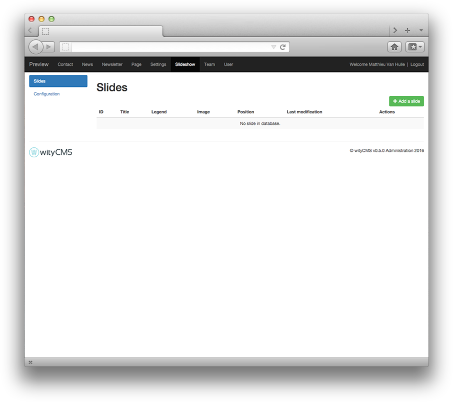
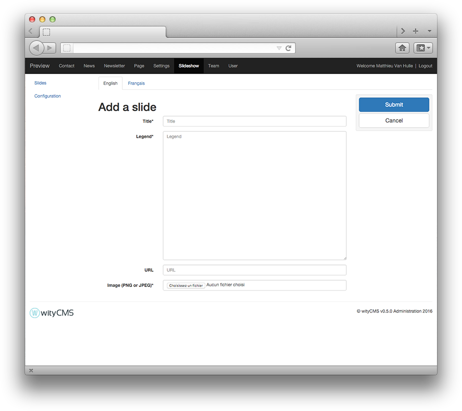
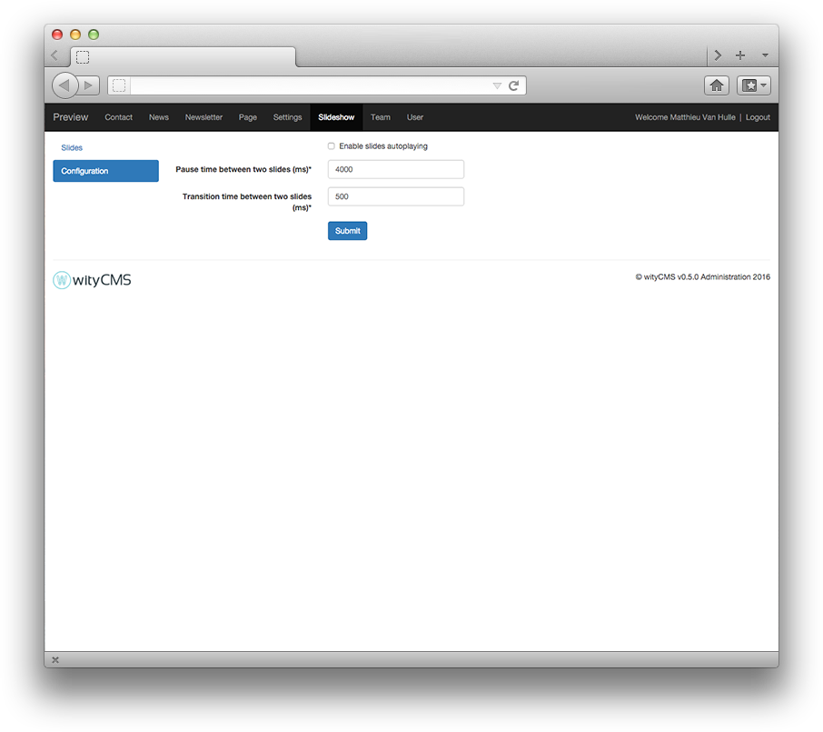

# Slideshow

The ***Slideshow*** application will allow you manage the slider on your website.

## Slides listing

The list contains all the slides created on your website. It gives you a rapid view of:

* Title
* Legend
* Image
* Position
* Last modification

The action button **Edit** allows you to *edit* or *delete* a page (according to permissions granted by your administrator).

## Add a slide

Click on the **Add a slide** button to create a new slide.

* **Title***: Start by indicating the title
* **Legend**: Input a short description of your slide.
* **URL**: Define an URL to redirect to an other page.
* **Image** (PNG or JPEG)*: It cannot exceed 2 MB.

## Configuration

**Configuration** tab, allows you to configure your slider.

* **Enable slides autoplaying**: Enable automatic slide changes.

When you decide to *enable slides autoplaying*, you can edit these two parameters:

* **Pause time between two slides (ms)**: the default value is 4000 ms.
* **Transition time between two slides (ms)**: the default value is 500 ms.
