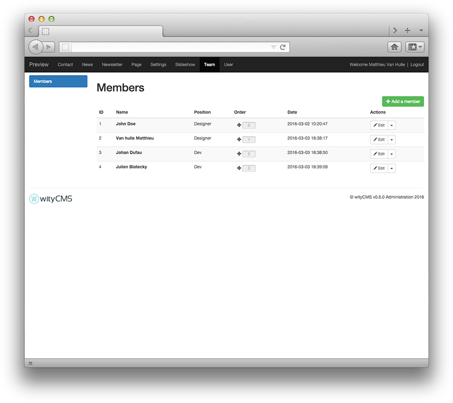
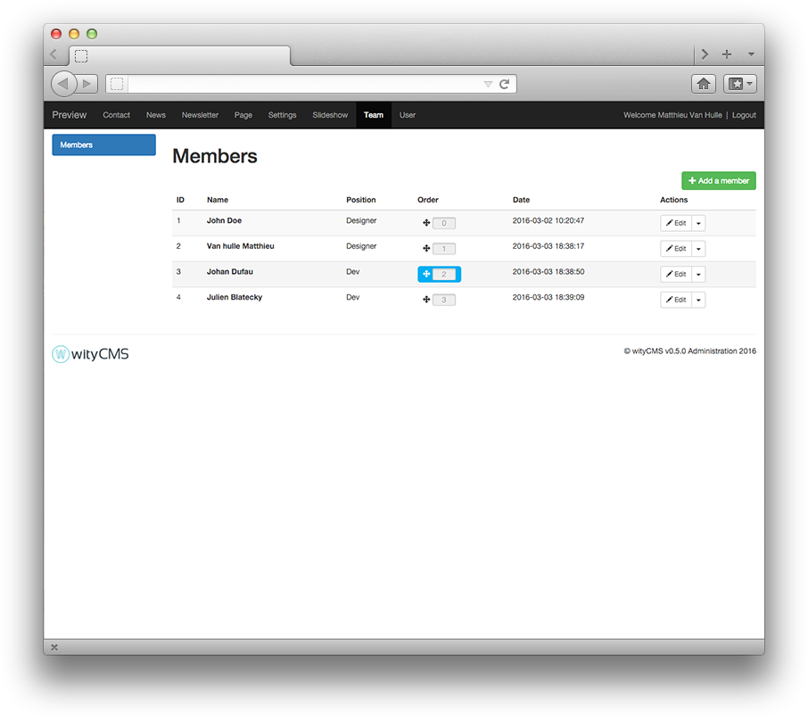
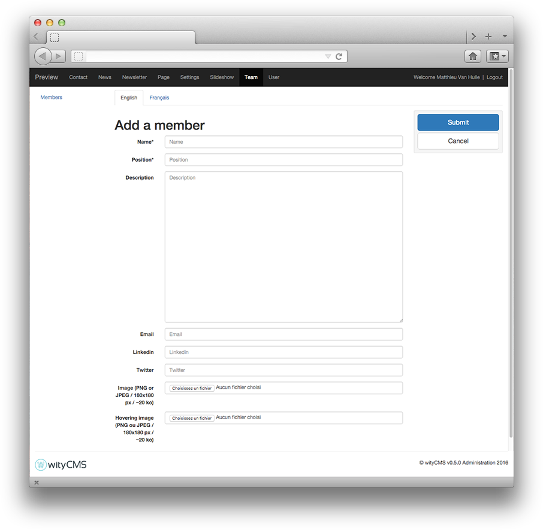

# Team

The ***Team*** application allows you to create profiles members for your team.

## Members listing

The list contains all the members created on your team. It gives you a rapid view of:

* Name
* Position
* Order
* Date

The action button **Edit** allows you to *edit* or *delete* a member (according to permissions granted by your administrator).

### Order

By default the members of your team are ordered by ID. But if you want you can reorder it. You just need to drag and drop a selected line before an other.

## Add a member

Click on the **Add a member** button to create a new member.

* **Name**: More often it is fill with the *First Name* and *last name* but you can also give a nickname.
* **Position**: Fill with the member position in your organization or team.
* **Description**: This field is actually not use in the front page. It's just here for SEO.
* **Email**: Member email's.
* **LinkedIn**: LinkedIn member page's.
* **Twitter**: Twitter member page's.
* **Image**: An image who as representative of the member.
* **Hovering Image**: The second image appear when you hovering it.
