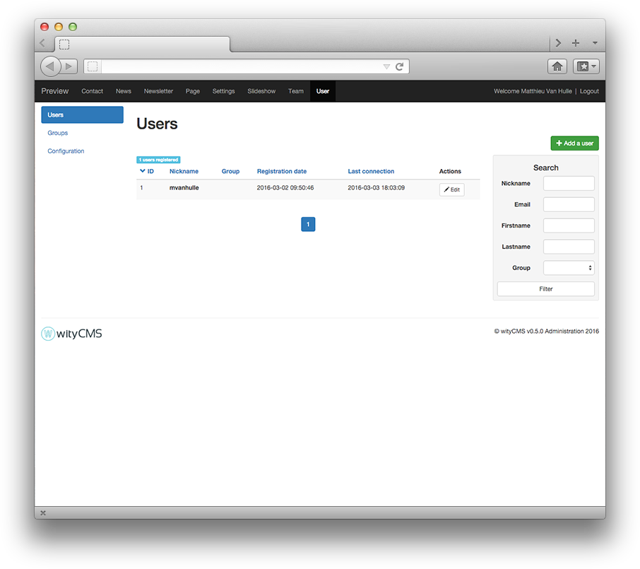
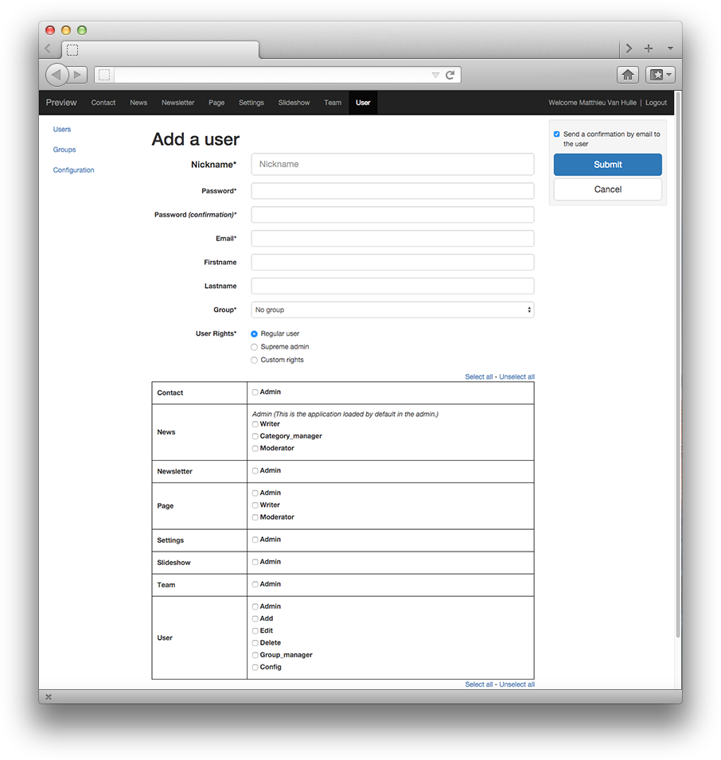
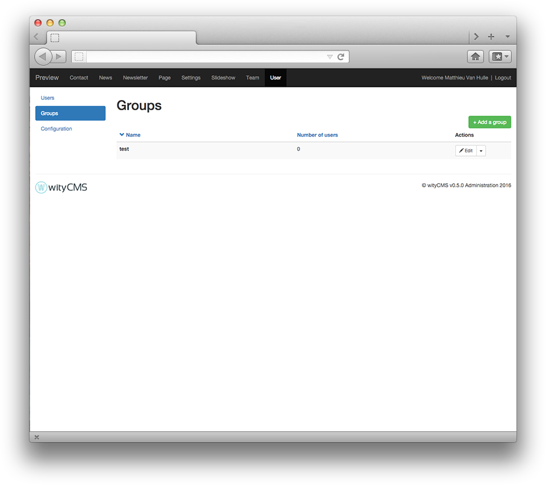
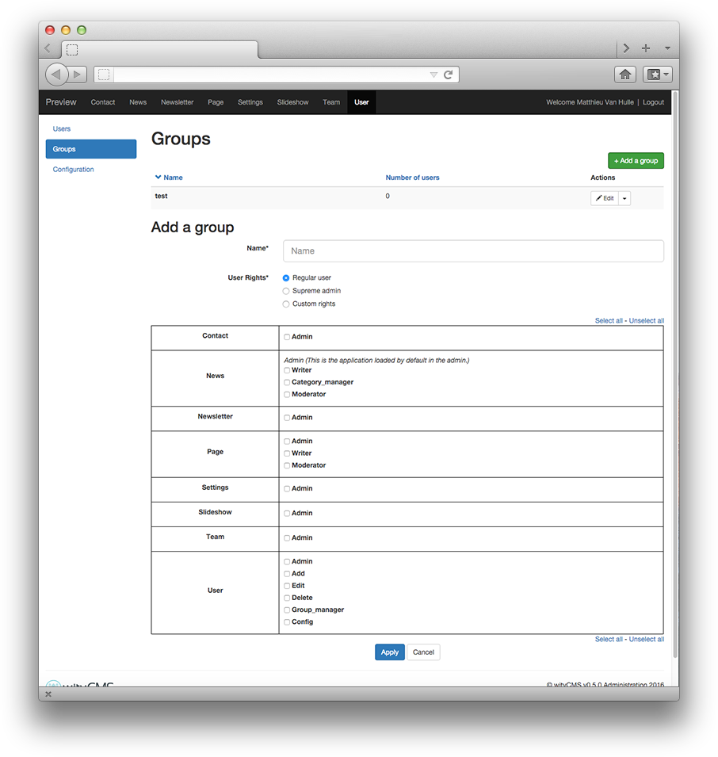
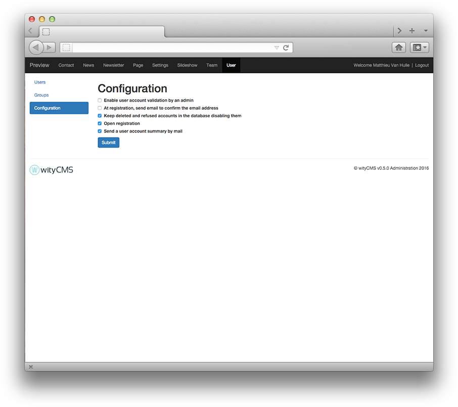

# User

The ***User*** application let you manage your website's registration process and all the user accounts.

## User listing

This list contains all registered users. It gives you a rapid view of:

* **ID**
* **Nickname**: used to log in
* **Group**
* **Last connection**

The action button **Edit** allows you to *edit* or *delete* a user (according to permissions granted by your administrator).

The bloc search at the right allows you to make a fast search when you need to find a user.

## Add a user

Click on the **Add a user** button,to create a new user. By default the registration are opened to any person who visits your website.

*  **Nickname**
*  **Password**
*  **Password (confirmation)**
*  **Email***: if the user needs to recover his personal code (nickname and password).
*  **First name**: (optional).
*  **Last name**: (optional).
*  **Group**: if you want define a group for specific access rights.
*  **User Rights**: Regular user / Supreme Admin / Custom rights access.

### Right access table

For each app, you can toggle a given access right.

* **Contact**: Admin
* **News**: Writer / Category_manager / Moderator
* **Newsletter**: Admin
* **Page**: Admin / Writer / Moderator
* **Settings**: Admin
* **Slideshow**: Admin
* **Team**: Admin
* **User**: Admin / Add / Edit / Delete / Group_manager / Config

## Groups

User application allows you to create groups, to define specific profile permission.

Give a name, and define the associated right you want for the group.

## Configuration

Manage the registration process.

* **Enable user account validation by an admin**: user account validation is not automatic, an admin need to validate account one by one.
* **At registration, send email to confirm the email address**: an email is automatically sent to confirm the email address before creating an account.
* **Keep deleted and refused accounts in the database disabling them**: the database keep all accounts created, even after deletion.
* **Open registration**: people have access to the registration form from the front office.
* **Send a user account summary by mail**: send a summary of the subscription to the user after account creation.
