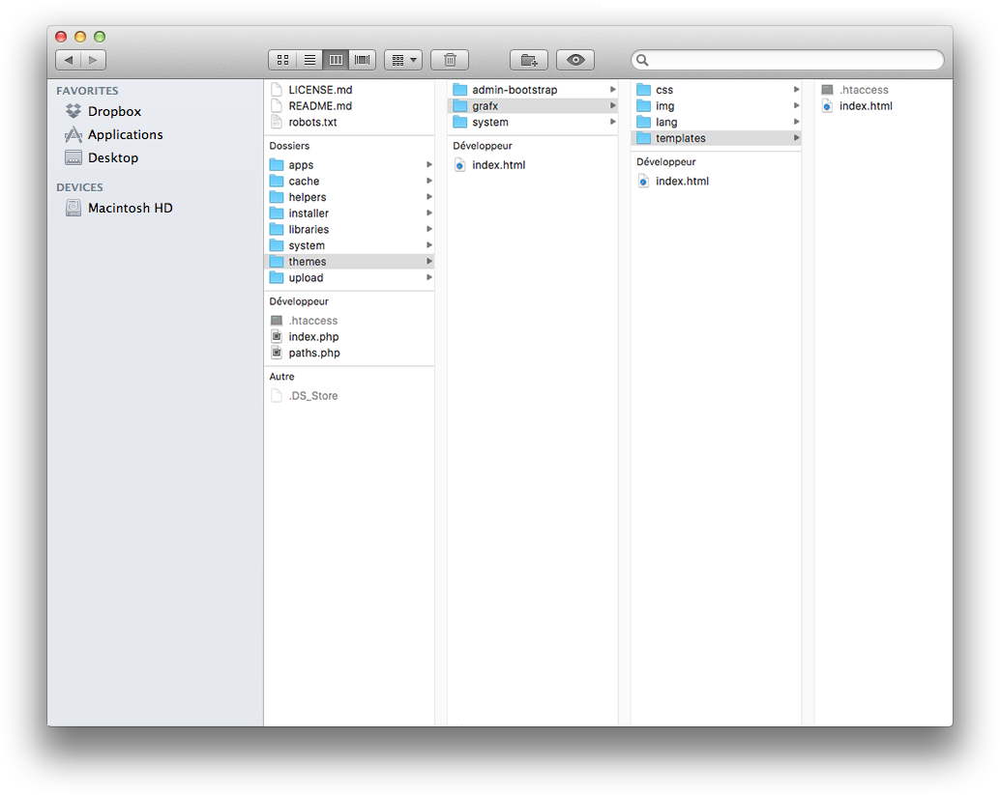

# Build a theme

wityCMS has a very simple files structure. You can have as many files and folders as you want in your theme, as long as a few required theme files are present.

The best point of reference is usually the default theme bundled with your wityCMS installation, since it’s always kept up to date, and it’s a fairly minimal theme. Just duplicate the folder, remove the CSS, and adjust markup as needed.

## Required theme files

It's mandatory you have the templates folder with the index.hmtl to define your theme. If you don't have these files, your theme won't work properly, or just won't show up at all.  



Templates folder contain all the"*.html*" index you need for the different theme page of your website.

An example how to introduce your index.html :

```html
<html lang="{$wity_lang}">
<head>
    <title>{$wity_page_title}</title>
    <meta charset="utf-8" />
    <meta name="description" content="{$wity_page_description}" />
    <meta name="viewport" content="width=device-width, initial-scale=1.0" />
    <meta name="generator" content="wityCMS 0.5" />
    <meta name="robots" content="index,follow" />
    {if !empty({$wity_site_favicon})}<link rel="icon" type="image/x-icon" href="{$wity_site_favicon}" />{/if}
    {if !empty({$wity_site_icon})}<link rel="apple-touch-icon" href="{$wity_site_icon}" />{/if}

    <meta property="og:title" content="{$wity_site_title}">
    <meta property="og:type" content="website">
    <meta property="og:url" content="{$wity_base_url}">
    <meta property="og:image" content="{$wity_site_icon}">
    <meta property="og:site_name" content="{$wity_site_title}">
    <meta property="og:description" content="{$wity_page_description}">

    <!-- Bootstrap -->
    <link href="/libraries/bootstrap-3.3.6/css/bootstrap.min.css" rel="stylesheet" />
    <link href="/themes/grafx/css/style.css?v=1.1.0" rel="stylesheet" title="Grafx" />

    <!-- HTML5 shim, for IE6-8 support of HTML5 elements -->
    <!--[if lt IE 9]>
        <script src="/libraries/IE-compatibility/html5shiv.min.js"></script>
        <script src="/libraries/IE-compatibility/respond.min.js"></script>
    <![endif]-->
    
    <script type="text/javascript">
        var require = {
            deps: ['bootstrap']
        };
    </script>
</head>
<body>
  {$notes}
  {$include}
</body>
</html>
```

## Standards files

### CSS Style

"**CSS**" folder will allow you to apply different "*html*" style element. They allow you to define any style property as the border , background color, typeface, the space between letters, etc. Through this method, all pages that reference the external style sheet will inherit all definitions.

**Font**

The Google Fonts API will generate the necessary browser-specific CSS to use the fonts. All you need to do is add the font name to your CSS styles. For example:

```css
font-family: 'Open Sans', sans-serif;
```

Here's an example. Copy and paste the following HTML into a file:

```html
<html>
  <head>
    <link rel="stylesheet" type="text/css" href="https://fonts.googleapis.com/css?family=Tangerine">
    <style>
      body {
        font-family: 'Tangerine', serif;
        font-size: 48px;
      }
    </style>
  </head>
</html>
```

### Images 

"**Img**" folder contain all the asset you need to custom your theme. For example, this is where you can modify the logo of "grafx" theme with your logo written the same way as "logo.png" or changing the name to the index.html. 

```html
<header class="theme-header">
    
    <div class="inner">
        <p class="site-name">{$wity_site_title}</p>
    </div>
    <div class="clear"></div>
</header>
```


## Internationalize your theme

* **lang**: The folder contain all the translation you need to switch you theme between different languages.