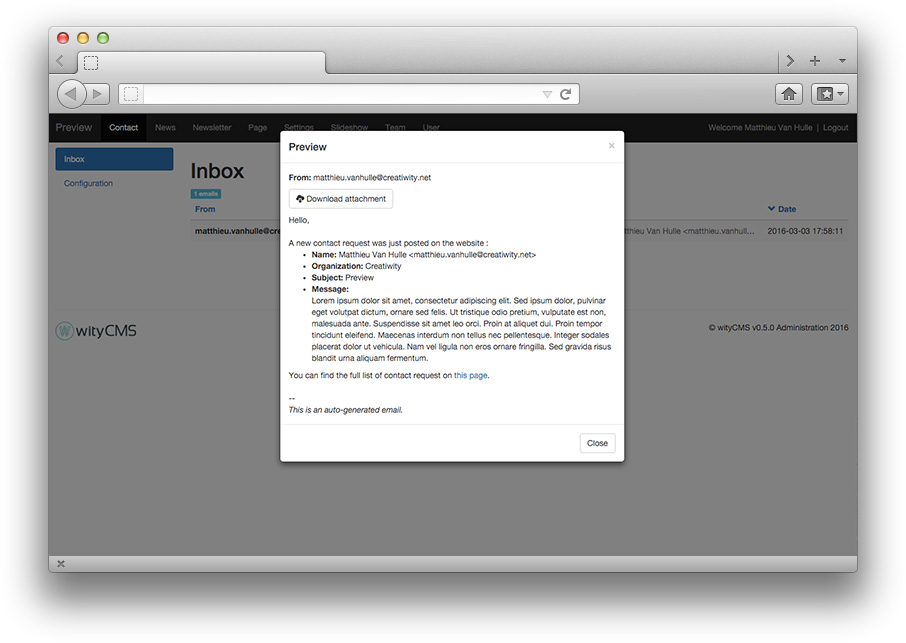
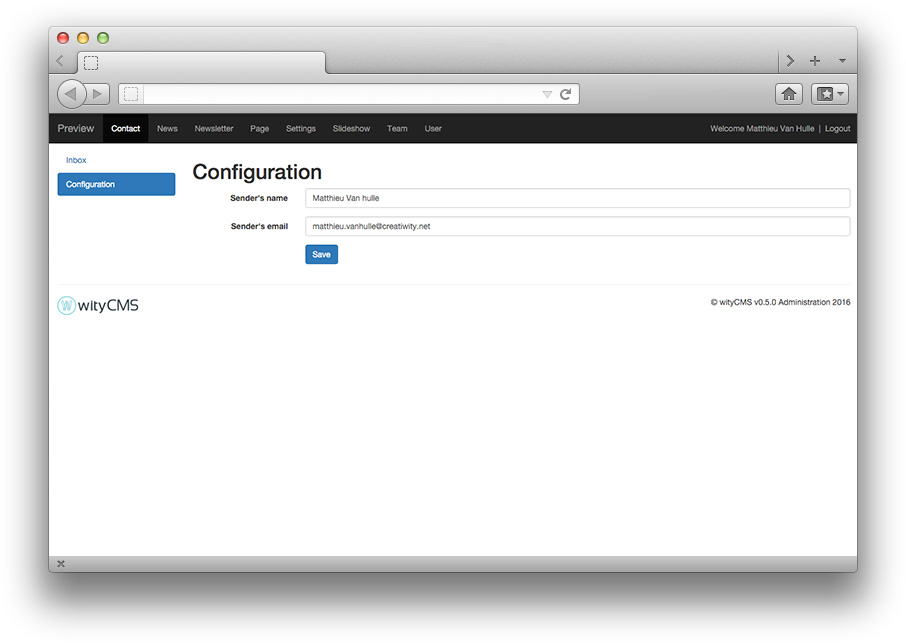

# Contact

The "**contact**" application will allow to manage and receive emails send to the website contact form.

## List

The list contains all emails send since the contact form exist.
It gives you a rapid view of: 

* "From": Email address of the person who sent an email
* "Subject": Title and content
* "Date": Date of expedition.

## Reading pop-up

To read a delivery email :

* Click on the message 
* A pop-up appear with all the content:
  * Title
  * From 
  * Message
  * Attachment 

## Configuration 

You can also configure a contact box to resend the email contact directly to a configure mail box.

* **Sender's name**: sender's name who receive the mail information
* **Sender's email**: sender's email who receive the mail information  
