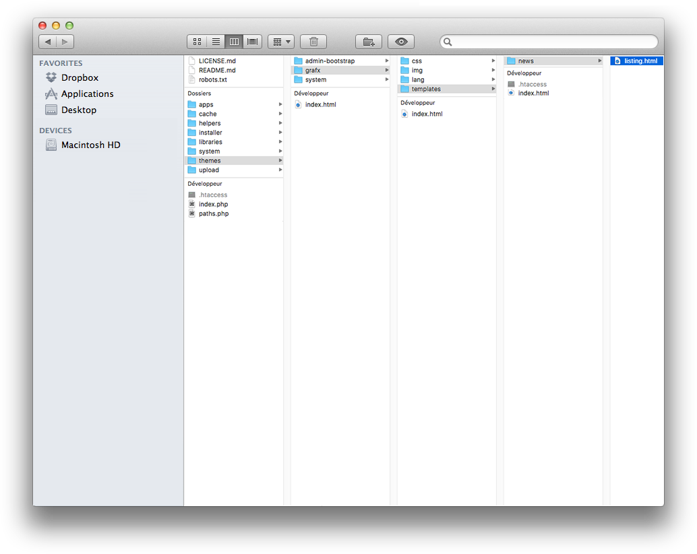

# Overriding application template

For each application page you want to customize you need to create a new file with this specification : 

By default each app has a template but if you want to overwrite, you need to create your new "**.html**" file who define your news guideline.

To find out how name your "**.html**" file select the app file (e.g: News) located in **.../app/news/front/templates/"listing.html"**.

Once you know how to name the file (e.g: News -> "listing.html"), you can create a new file located in **.../theme/"nametheme"/templates/"nameapp"**. Now you can drop your "listing.html" who overwrite that one content in the app folder.

