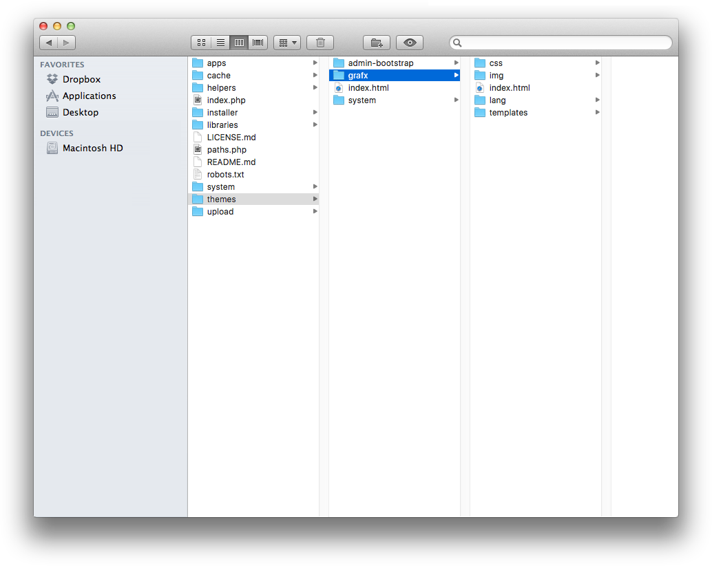

# File Structure

wityCMS has a very simple files structure. You can have as many files and folders as you want in your theme, as long as a few required theme files are present.

## Required theme files
If you don't have these files, your theme won't work properly, or just won't show up at all. It's vital you have these files.

* **css**: The folder will allow to apply different "*HTML*" style element. They allow you to define any style property as the border , background color, typeface, the space between letters, etc. Through this method, all pages that reference the external style sheet will inherit all definitions.
* **img**: The folder contain all the asset you need to custom your theme like the logo, etc.
* **lang**: The folder contain all the translation you need to switch you theme between different languages.
* **templates**:The folder contain all the"*HTML*" index you need for the different theme page of your website.

