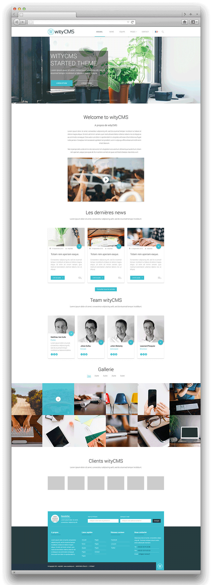

# Front

You installed a system, a web server that supports PHP, database software and wityCMS.

So you can explore the software by adding content to it, by changing its interface, installing and developing new modules add functionality and many other things ...

## First Step

Once you have finished installing your website you will access to him at the address you indicated during the installation: http://www.votresite.com.

The home page of your site is the page that you mentioned at the second stage of the installer, which is usually the application "news".

