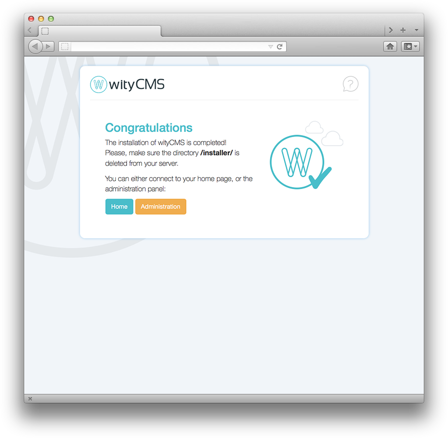

# Front

You installed the following systems:

1. A web server that supports "*PHP*"
2. A database software 
3. wityCMS

From now on, you can explore wityCMS:

* adding content
* changing the interface
* installing modules
* developing functionalities

## First Step

Once you have finished the installation of your website, you can access to it by clicking on the “**home**” button.

You will then be redirected to the front-end app you chose during the second installation step. It is most often  the application "**news**".
