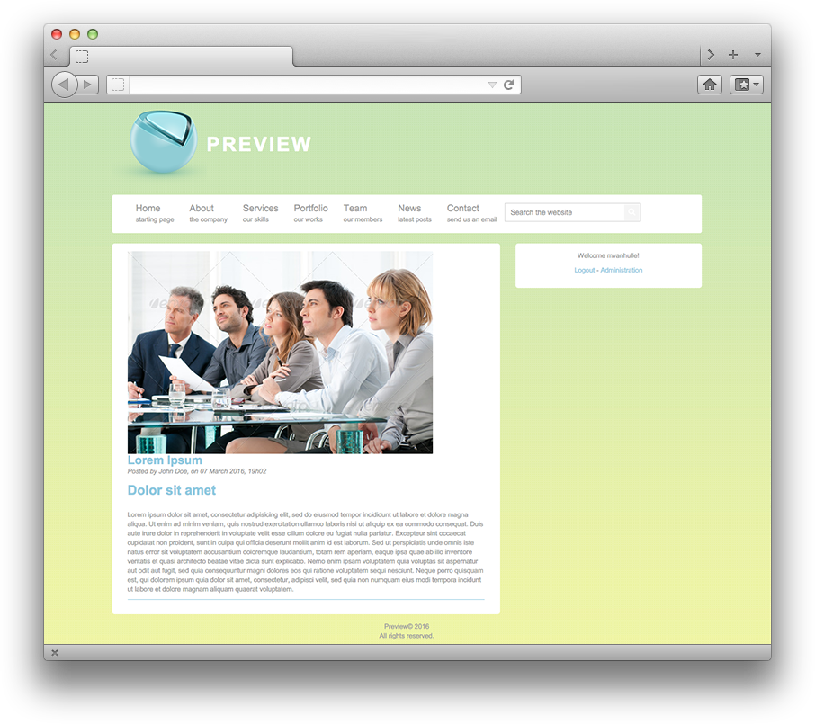

# Website Home

Your website home is divided into different space.

* The header who is define by the logo and the name of your website (here is "Preview")
* The navigation bar who allows you to navigate between the different part of your website
* The main block who display your website content according to your navigation location
* At the right you have the identification zone who allow you to connect you to the website

