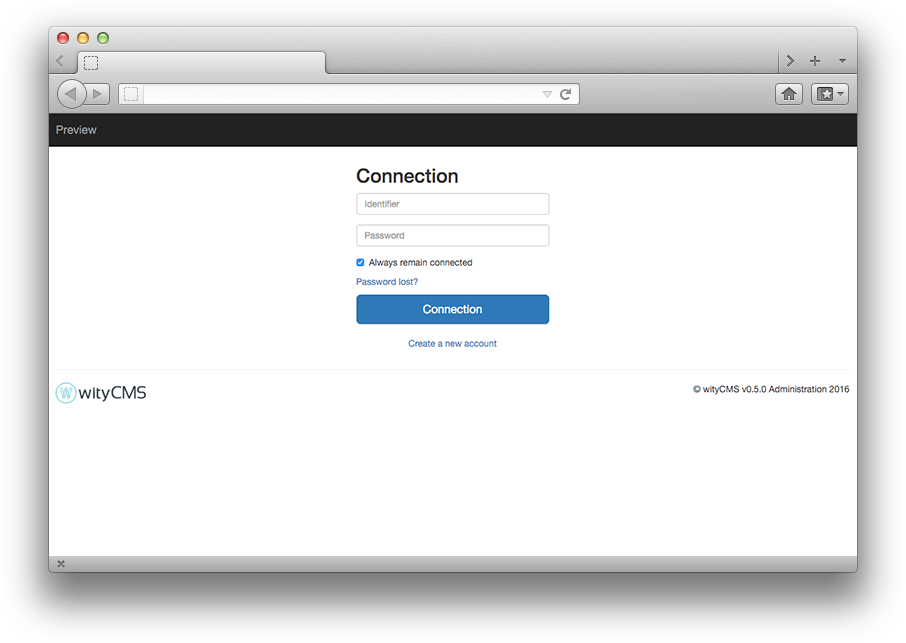
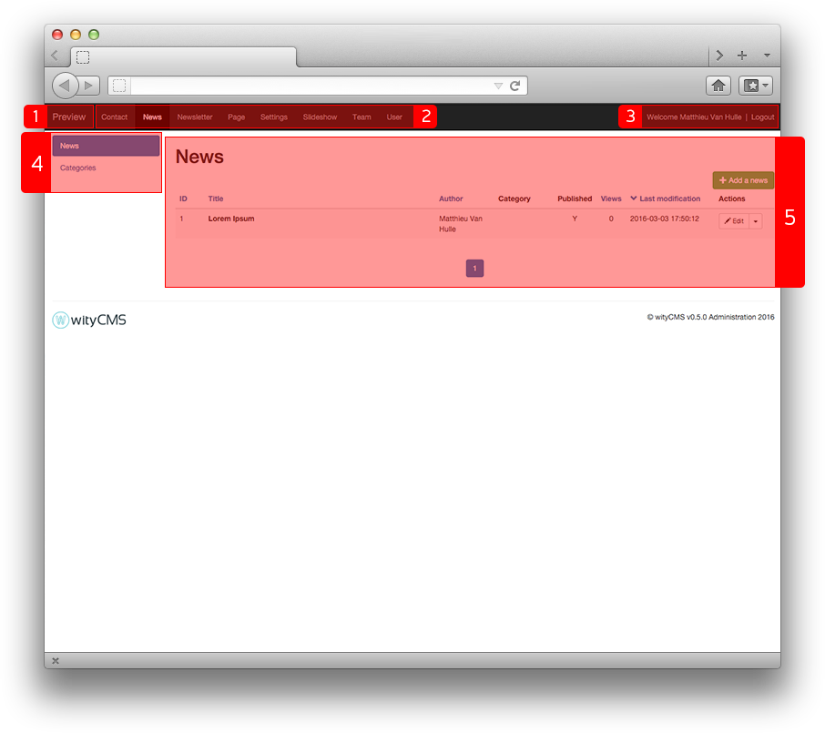

# Administration and Settings

wityCMS comes with an administration panel accessible through the `www.sitename.com/admin` URL. If needed, you will be invited to login (Identifier and password) with your admin account:

## Dashboard description

Your administration panel is divided into five areas:

1. The website name which is also a link to the front office
2. The application selector
3. A logout button to disconnect your account
4. The application menu to access to the different sections of your application
5. The content area to edit your news, pages etc.

## Settings

The ***Settings*** application will allow you to configure general settings of your website.

### General
*General* - it is the main configuration of your website.

* **Website's name**: it is the name you need to give at your website to define your activity.
* **website's base URL**: it is the Uniform Resource Locator who give acces to your website. By default, this field is pre-filled.
* **Time zone***: By default, the Time Zone is always (UTC + 01: 00) Paris.
* **favicon (.ico)**: The favicon used in the address bar, bookmarks, tabs, or other shortcuts. More often, it is the logo of your company or a graphic that represents the activity of your website.
* **Default Theme**: Choose the theme for your website. The field is always pre-filled with the basic theme "grafx".
* **Google Analytics**: Fill with your google analytics ID.
* **Version**: Version number of your website (useful to recharge the CSS / JavaScript in the browser resource).
* **Debug mode**: Display or not the errors.
* **Anti flood mode**: prevent to return the form many times.

### Default applications

* **Default application**: The default application is the first application executed by wityCMS. It will be displayed when a visitor connects to the root page of your website. For instance, if you want to create a blog, we advise you to select the ***News*** application.

* **Default application in admin**: The main admin application is the first application loaded when you open the administration. We advise you to select the application you will mainly use (***user*** or ***news*** for instance).

When finished, you just need to **submit** and your website get the minimal configuration.
