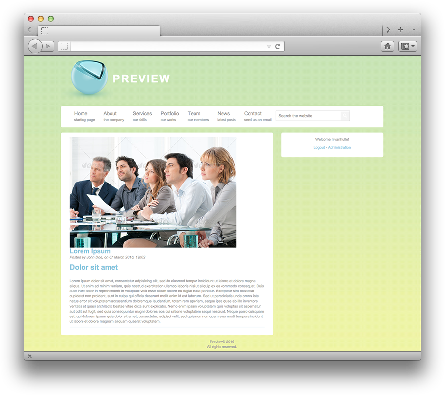

# Website Home

Your website home is divided into different spaces.

* The logo and the web site name
* The navigation bar to navigate between the different parts of your website
* The main block which displays your website content according to your navigation location
* At the right you have the identification zone, to connect to the administration

