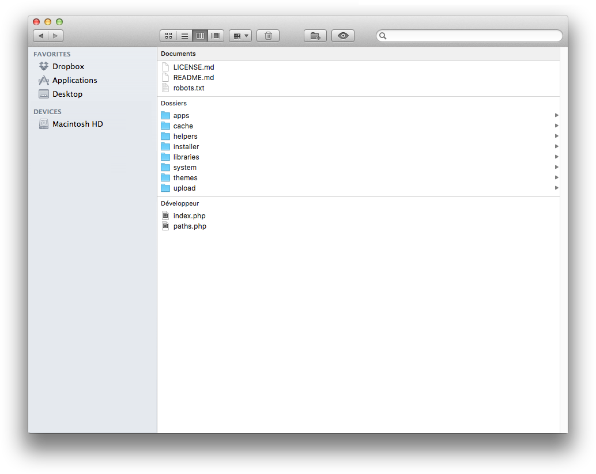
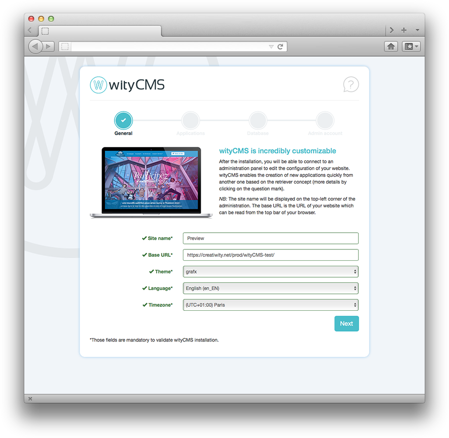
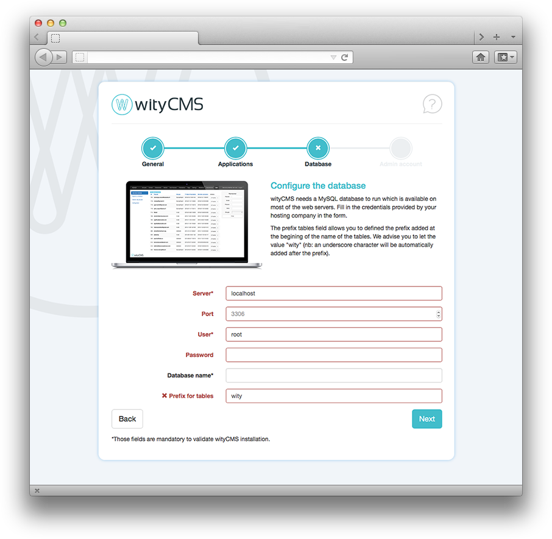
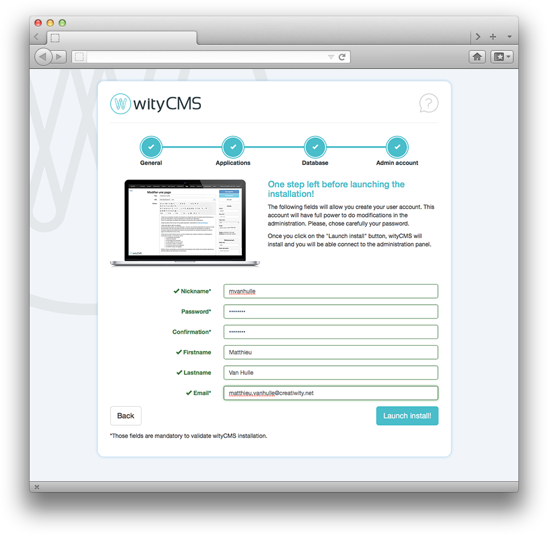

# Installation

## Download wityCMS

You will now install wityCMS from its source files. 
Go to the download section of [Creatiwity](https://www.creatiwity.net) website and download the latest version of wityCMS.

1. Extract the files from the zip folder and save it on your computer (remember to note the location).
2. With your FTP program (eg: [FileZilla](https://filezilla-project.org/)), send from your computer to your server the folder, keeping exactly the same structure (folders and files).

Folder structure:

## Web Server configuration

Apache server with *PHP5.3+*, mod_rewrite enabled and *.htaccess* files allowed.

## wityCMS installation

Once the files are installed on your FTP server from the ***FileZilla***. You can open your browser, type the URL of the file where you saved files, for example: "http://www.nameofyourwebsite.com" if it is at the root of your FTP.

This will redirect you to the installation wizard. At this stage, only remains to follow the 4 steps to install wityCMS. You can only complete the installation once the 4 steps are done and validated by clicking the button "**Launch install**".

### General

* **Site name***: Specify the name you want to give to your website.
* **Base URL***: Inquire the URL where the file name saved export the .ZIP. By default, this field is pre-filled.
* **Subject***: Choose the theme for your website. The field is always pre-filled with the basic theme.
* **Language***: You must specify the language you want to give to the system. The default language is English.
* **Time zone ***: By default, the "Time Zone" is always (UTC + 01: 00) Paris.

### Application

* **Home application***: The Home application is the first application executed by wityCMS. It will be displayed when a visitor connect to the root page of your website. For instance, if you want to create a blog, we advise you to select the "**News**" application.

* **Main admin application***: The main admin application is the first application loaded when you connect to the administration. We advise you to select the application you will mainly use (**user** or **news** for instance).

### Database

wityCMS needs a *MySQL* database to run. It is available in the majority of the web servers. Fill in the form with the credentials provided by your hosting company.

* **Server***: localhost
* **Port**: 3306
* **User***: root
* **Password**: 
* **Database name***:

*Prefix tables* field allows you to defined the prefix added at the beginning of the name of the tables. We advise you to let the value "**wity**" (nb: an underscore character will be automatically added after the prefix). This prefix allows you to separate the wityCMS tables from other tables that you might use in the same database.

* **Prefix for tables***: wity

### Admin account

The following fields will allow you create your user account. The user of this account will have full power to do modifications make changes in the administration section. Please, choose carefully your password.

Once you click on the "**Launch install**" button, wityCMS will be installed. You will be able connect to the administration panel (back office).

* **Nickname***:
* **Password***:
* **Confirmation password***:
* **Firstname**: 
* **Lastname**:
* **Email***:

### Let's start 

Congratulation, the installation of wityCMS is completed! Please, make sure the directory /**installer**/ is deleted from your server.

You can either connect to your home page, or to the administration panel with the two buttons:
* **"Home" button**: you are redirected on the front-end app you chose during the second installation step
* **"Administration" button**: you are redirected on the back-end app you chose during the second installation step. You need to login with the information you provided during the last step of your installation. 
