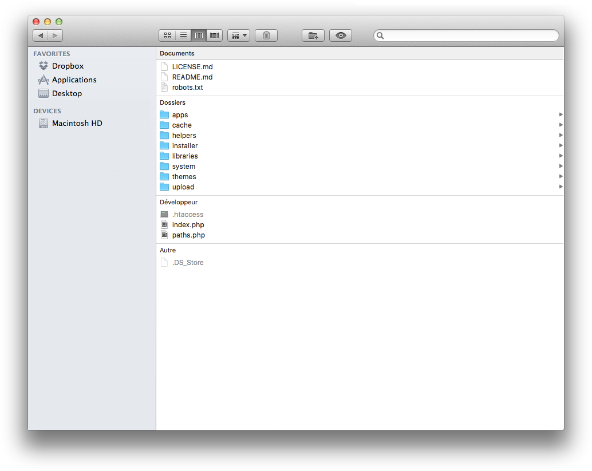

# Installation

## Download wityCMS

You will now install wityCMS from its source files. 
Go to the download section of [Creatiwity](https://github.com/Creatiwity/wityCMS/releases/download/0.5.0/wityCMS-0.5.0.zip) website and download the latest version of wityCMS.

1. Extract the files from the zip folder and save it on your computer (remember the location).
2. With your FTP software (eg: [FileZilla](https://filezilla-project.org/)), upload the previously extracted folder to your server.

Folder structure:

## wityCMS installation

Once the upload finished, open your browser and type the URL of your website (eg: http://www.nameofyourwebsite.com if you uploaded the files at the root of your website).

This will redirect you to the installation wizard. At this stage, you just have to follow the 4 steps to install wityCMS. 

NB: the four sections must have the validated tick to enable the **Launch install** button.

### General

* **Site name***: Specify the name you want to give to your website.
* **Base URL***: Specify the website's URL. By default, this field is pre-filled.
* **Theme***: Choose the theme for your website. The field is always pre-filled with the basic theme.
* **Language***: You must specify the language you want to give to the system. The default language is English.
* **Time zone***: By default, the Time Zone is always (UTC + 01: 00) Paris.

### Application

* **Home application***: The Home application is the first application executed by wityCMS. It will be displayed when a visitor connects to the root page of your website. For instance, if you want to create a blog, we advise you to select the ***News*** application.

* **Main admin application***: The main admin application is the first application loaded when you open the administration. We advise you to select the application you will mainly use (***user*** or ***news*** for instance).

### Database

wityCMS needs a **`MySQL`** database to run. Hosting providers often provide one. Fill in the form with the credentials provided by your hosting company.

* **Server***: localhost by default
* **Port**: 3306 by default
* **User***
* **Password**
* **Database name***
* **Prefix for tables***: wity

*Prefix tables* field allows you to define the prefix added at the beginning of the name of the tables. We advise you to let the value "**wity**" (nb: an underscore character will be automatically added after the prefix). This prefix allows you to separate the wityCMS tables from other tables that you might use in the same database.

### Admin account

The following fields will allow you create your user account. This account will have full priviledges to make changes in the administration section. Please, choose very carefully your password.

Clicking on the **Launch install** button will finish the installation. You will be able to connect to the administration panel (back office).

* **Nickname***
* **Password***
* **Confirmation password***
* **Firstname**
* **Lastname**
* **Email***

### Let's start 

Congratulations, the installation of wityCMS is over! Please, make sure the directory `/installer/` is deleted from your server.

You can either connect to your home page, or to the administration panel with the two buttons:
* **Home button**: you are redirected on your website's home you chose during the second installation step.
* **Administration button**: you are redirected on the back office. You need to login with the information you provided during the last step of your installation.