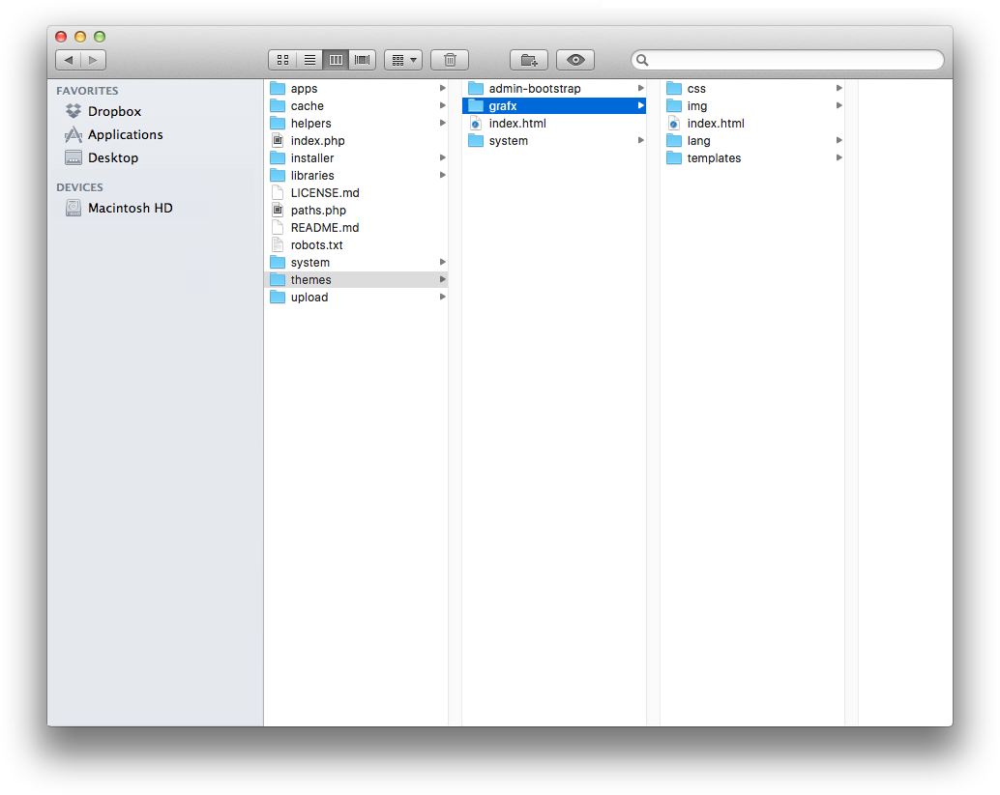

# Overview

wityCMS uses its own templating system, named [WTemplate](https://github.com/Creatiwity/WTemplate), developed as [a separate GitHub project](https://github.com/Creatiwity/WTemplate) but included here as a submodule.

Theming in wityCMS is easy; all you need is some basic knowledge of HTML, CSS, and PHP. With our functions, it’s easy making a theme.

## Theme definition

All wityCMS theme are contents in a same folder "**themes**". When you want to creat a new theme it is important to create a new folder in the name of your "theme name" (e.g:grafx).

1. First you need to define a name for your theme.
2. Create a new folder with your theme name in .../themes/"theme name"

The best point of reference is usually the default theme bundled with your wityCMS installation, since it’s always kept up to date, and it’s a fairly minimal theme. Just duplicate the folder, remove the CSS, and adjust markup as needed.

Alternatively, you can check out some themes made by the community, or create your own from scratch. It‘s up to you.

