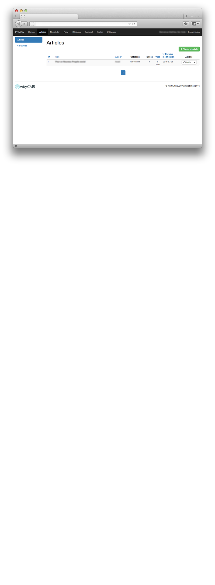
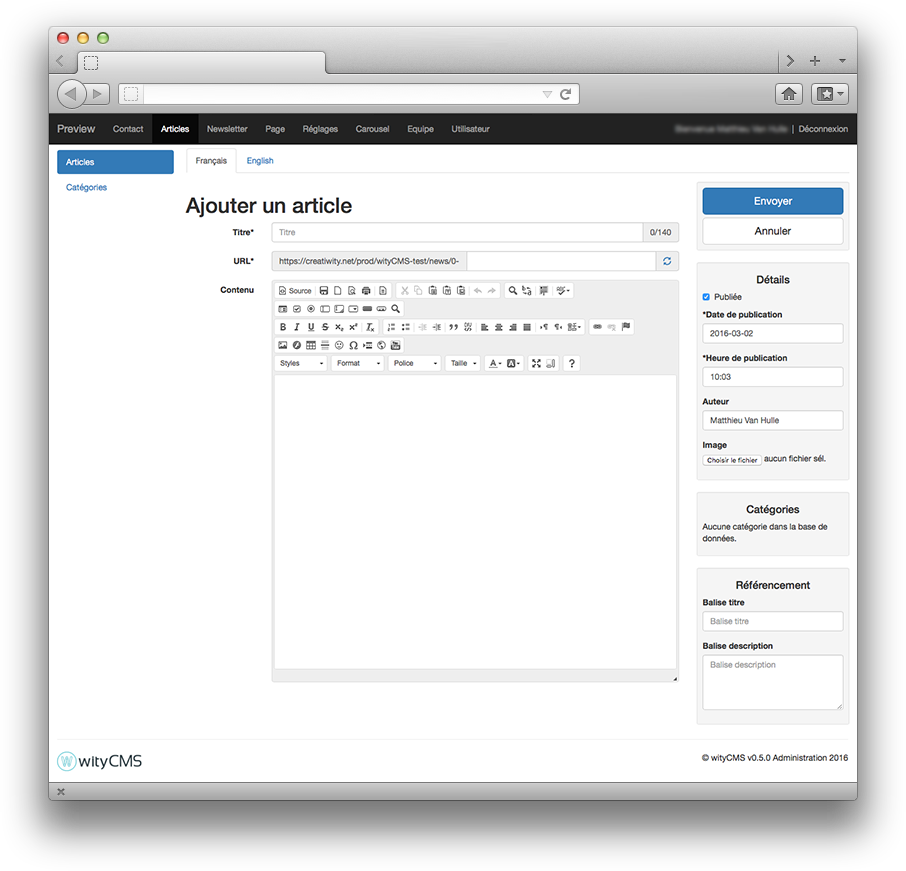
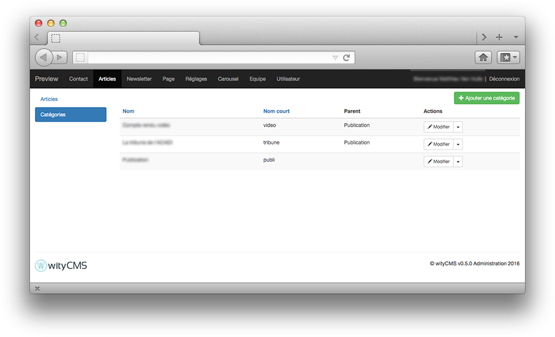

# News

News are managed by the News application. Categories can be used to categorize your articles.

To differentiate news page, let's just say that a few web page has only one CMS page or multiple news after each other (like a blog). This solution offers a dynamic side that does not have the Pages, inversely (or vice versa), the information is not sustainable on the screen, a new item is automatically placed above the last, shifting the presentation of your page. News are slightly more complex hierarchy that pages.

Finally the news may be subject to rules of publication, date of publication, date of withdrawal. It doesn’t exist for the pages.

Using news is interesting to create and manage your site's news, key announcements. If you think you create an RSS feed, these are the items that will be used. Interesting for those who want to subscribe to the latest news from your website ...

News application will allow you to add single news to your website from the backend, the frontend with a text editor (CKEditor V2.0). ([CKEditor documentation](http://docs.ckeditor.com/)).

## List

This list contains all the items created and gives you the title, author, category it belongs, its state of publication, the number of times it has been seen, the modification date and a rapid button action to go to editing or deleting the article. In the top right of this list, a button invites you to create a new article. Click on **"Add news"**.

## Create and edit news

### Editing:

After clicking the button "Add news" in the upper right of the wityCMS admin. You arrive on creating page of your article.

* **Title***: Start by indicating the title of your article (it must not exceed 140 chars).
* **URL**: you will be automatically generated URL in relation to the title you have just entered. You can if you want to change this URL.
* **Content**: This is where it all happens. Thanks to **[CKEditor](http://docs.ckeditor.com/)** you will be able to write, layout your article and add pictures/videos as desired.

### Details:

On the side you will find the schedule information in your article:

* **Published**: yes / no (this will allow you to write an article without disclosing it on the canvas immediately).
* **Publication time***: it’s automatically filled when you creating your article. However, you can edit yourself the time of the publication as desired.
* **Author**: you can mention the author of the article; the default author name is the name of default account with which you are connected.
* **Image**: The image field is used to select the picture of your article on your topic (using like header/ news preview etc.)

### Categories:

If you mentioned categories in the basic site data, this is where you can indicate it to categorize your articles. (will you described how are managed categories).

### SEO:

* **Tag title**:
* **Tag description**:

### Validate your news:

* **Submit**:
* **Cancel**:

## Categories

You can have many news and their subjects totally different, so its difficult for readers to navigate and to have quick access to the information.
To overcome this drawback, wityCMS offers the ability to create categories in which you can store your news according to their content.

To create a new category, click on the "category" tab. WityCMS lists the already existing categories. In this list, only editing or deleting a category is available. You must click on the button "add categories" to create a new one.

* **Name**:
* **Shortname**:
* **Parent**:
* **Actions**:

