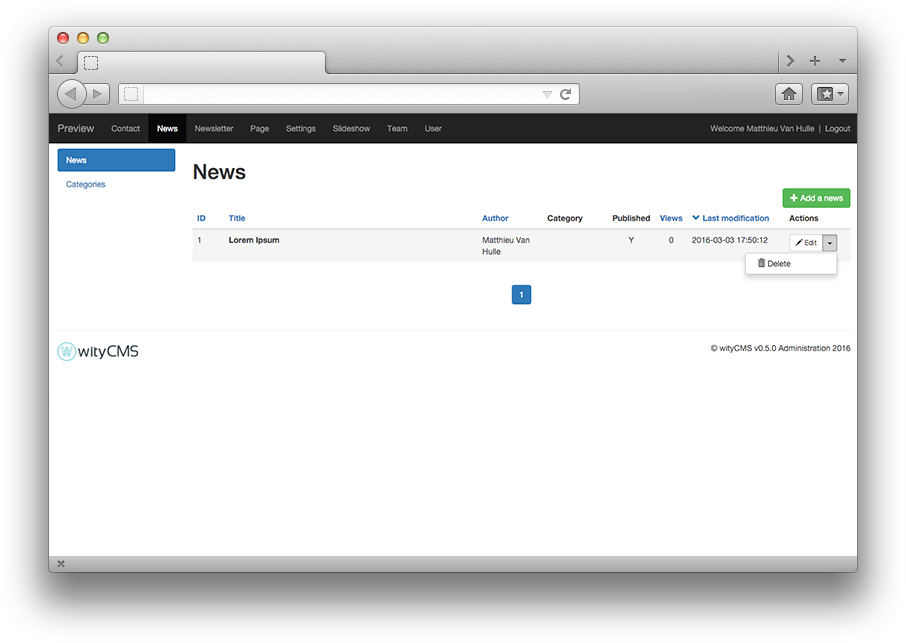
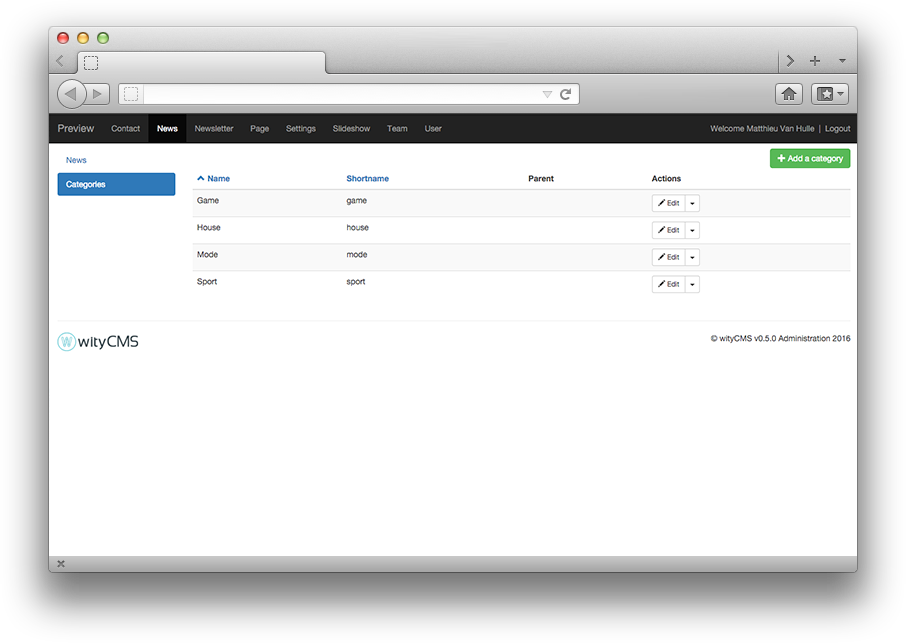

# News

To differentiate the two application "**News**" to "**Pages**", let's just say that application news has only one CMS page with multiple news after each other (like a blog).

"**News**" offers a dynamic side that does not have the "**Pages**". Moreover, the information is not sustainable on the screen, a new item is automatically placed above the last, shifting the presentation of your page. "**News**" are slightly more complex hierarchy that pages.

"**News**" appluclation follows the rules of publication: date of publication, text modification etc.

Using "**News**" application is interesting to create and manage your site's news, key announcements etc. If you think you create an "*RSS feed*", these is the application that will be used. Interesting for those who want to subscribe to the latest news from your website for example. 

"**News**" application will allows you to add single news to your website from the back-end to front-end with an advanced text editor ([CKEditor](http://docs.ckeditor.com/)).

## List

The list contains all the news created on your website. It gives you a rapid view of: 

* The title 
* Author
* Category it belongs
* State of publication
* The number of views
* The last modification date

## Create and edit news

The rapid action button "**Edit**" permit you to edit or delete the current news. 
If you want to add a news: Click on green button **"Add a news"**.

### Editing:

After clicking the button "Add a news" in the upper right of the wityCMS admin. You arrive on "Add a news" page.


* * **Title***: Start by indicating the title of your news (it must not exceed 140 chars).
* **UR***: you will be automatically generated URL in relation to the title you have just entered. You can if you want change this URL.
* **Content**: This is where it all happens. Thanks to **[CKEditor](http://docs.ckeditor.com/)** you will be able to write, layout your news and add some pictures and videos as desired.

### Details:

On the side you will find the schedule information in your news:

* **Published**: yes / no (this will allow you to write an news without disclosing it on the canvas).
* **Date of publication***: it’s automatically filled when you creating your news. However, you can edit yourself the time of the publication as desired.
*  **Hour of publication***: it’s automatically filled when you creating your news. However, you can edit yourself the time of the publication as desired.
* **Author**: you can mention the author of the news; the default author used, is the name of default account with which you are connected.
* **Image**: You can load a main image for your news (using like header / news preview etc. That depend of the used template).

### Categories:

If you mentioned categories in the basic site data, this is where you can indicate it to categorize your news.

### SEO:

Meta tags, Title and Link are html tag inserted in the ```<head >``` section of a web page (before the ```<body>``` ). They help provide guid to the search engines , social networks and other systems to categorize the news content using metadata. The information in these tags are not visible on the screen, but appear in the source code of the page.

* **Meta title**: 
* ** Meta description**:

### Submit your news:

* **Submit**:
* **Cancel**:

## Categories

You can have many news and their subjects totally different, so its difficult for readers to navigate and to have quick access to the information.
To overcome this drawback, wityCMS offers the ability to create categories in which you can store your news according to their content.

To create a new category, click on "Categories" tab.
This list contains all the categories created and gives you the name, shortname, parent page.
In this list, only editing or deleting a category is available.


You must click on the button "add categories" to create a new one.


* **Name**: Geek
* **Shortname**: geek
* **Parent**: Game
* **Actions**: Create

A notification inform you "the category **Geek** was successfully created".

You can also delete a categories when you want with the action button. 

To confirm deletion, a pop-up appear asing you "Do you really want to delete this category?".
If you are certain clic on "**Delete**" if not clic on "**Cancer**".

A notification appear to inform that the category is successfully deleted.
