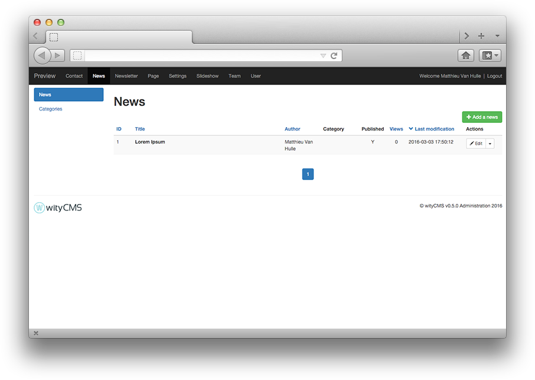
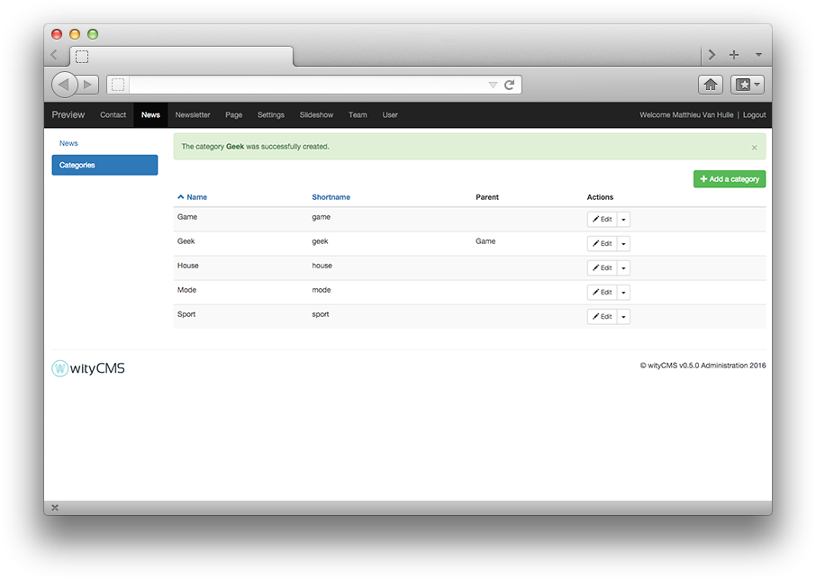
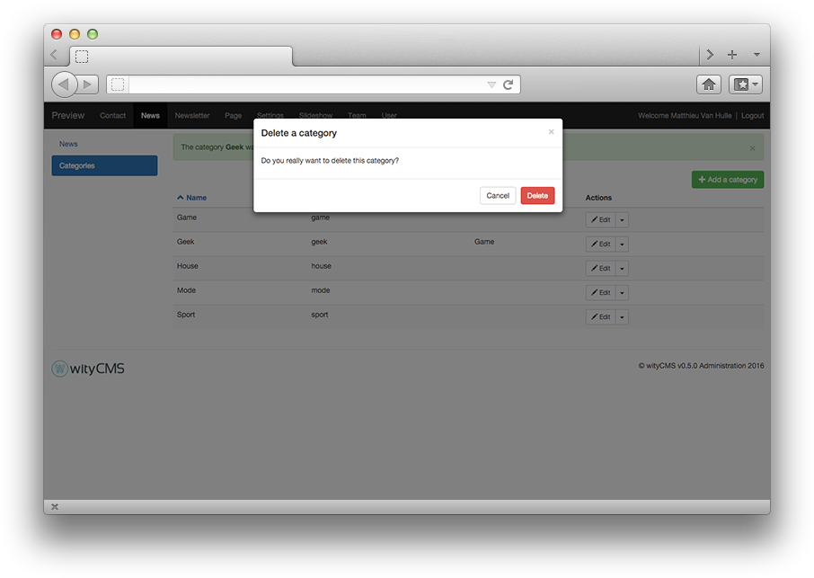

# News

"**News**" application lets you manage a collection of articles or posts ordered by publication date and sorted by categories.

Using "**News**" application is helpful if you want to create and manage your site's news, like a blog. 

## News listing

The list contains all news created on your website. It gives you an overview of: 

* The title 
* Author
* Category it belongs
* State of publication
* The number of views
* The last modification date

For each news you can edit or delete it using the action button at the end of the row. 
Moreover you can add a news by clicking the **"Add a news"** button.


## Create and edit news

The action button "**Edit**" enables to edit or delete the current news. 
If you want to add news: Click on green button **"Add a news"**.

### Editing:

After clicking the button "Add a news" in the upper right of the back-office. You can write the content.


* **Title***: Start by indicating the news title *(it cannot exceed 140 characters)*.
* **URL***: The URL will be automatically generated with the information you filled in the title form. If you want, you can change this URL.
* **Content**: with **[CKEditor](http://docs.ckeditor.com/)** you are able to write, layout your news and add some pictures and videos as you wish.

### Details:

On the right side, you notce the details about your current news:

* **Published**: yes / no (this enable you to write news without publishing it on your website).
* **Date of publication***: it is automatically filled in when you publish your news. You can also edit the date of publication.
*  **Hour of publication***: it is automatically filled in when you publish your news. You can edit the time of publication.
* **Author**: by default the author is the name of the account with which you are logged in. You can edit the author.
* **Image**: You can upload a main image(use like header / news preview etc., depending on your template).

### Categories:

Categories enable to classify your news according to the news content. This part is explained later. 

### SEO:

Meta tags, Title and Link are "**html**" tag inserted in the ```<head >``` section of a web page (before the ```<body>```. 

They help you to provide "*guide*" for the search engines, social networks and other systems using "*metadata*". The information on those tags are not visible on your website, but it appears in the source code of the page.

* **Meta title**: by default it is the news name
* ** Meta description**:

### Submit your news:

* **Submit**:
* **Cancel**:

## Categories

You can have several news and subjects totally different. This is how, wityCMS offers you the possibility to arrange your news in different categories according to the content.

This list includes all the categories and gives you the name, shortname and the parent page (if it is specified).


You must click on the green button "**Add a category**" to create a new category.


* **Name**: fill with the name of your category (e.g: Geek)
* **Shortname**: specify a "shortname" if you want (e.g: geek)
* **Parent**: specify if it is a sub category (e.g: Game)
* **Actions**: *create* or *abandon*

A notification inform you "the category **Geek** was successfully created".

You can also delete a category when you want with the action button "**Delete**". 

To confirm deletion, a pop-up appear asking you: "Do you really want to delete this category?".
If you are certain, click on "**Delete**" if not click on "**Cancel**".

After your deletion, a notification appear to inform you that "Category successfully deleted". 
