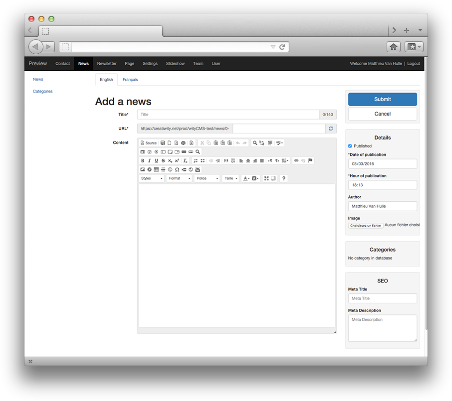

# News

News are managed by the News application. Categories can be used to categorize your articles.

To differentiate news to page, let's just say that application news has only one CMS page with multiple news after each other (like a blog). This solution offers a dynamic side that does not have the Pages, inversely, the information is not sustainable on the screen, a new item is automatically placed above the last, shifting the presentation of your page. News are slightly more complex hierarchy that pages.

Finally the news may be subject to rules of publication, date of publication, text modification etc.

Using news application is interesting to create and manage your site's news, key announcements. If you think you create an RSS feed, these are the items that will be used. Interesting for those who want to subscribe to the latest news from your website ...

News application will allow you to add single news to your website from the back-end to front-end with a text editor (CKEditor V2.0). ([CKEditor documentation](http://docs.ckeditor.com/)).

## List

This list contains all the news created and gives you the title, author, category it belongs, its state of publication, the number of times it has been seen, the last modification date.

## Create and edit news

Rapid action button "**Edit**" permit to edit or delete the news. 
To add new content Click on **"Add a news"**.

### Editing:

After clicking the button "Add a news" in the upper right of the wityCMS admin. You arrive on "Add a news" page.

* * **Title***: Start by indicating the title of your news (it must not exceed 140 chars).
* **UR***: you will be automatically generated URL in relation to the title you have just entered. You can if you want change this URL.
* **Content**: This is where it all happens. Thanks to **[CKEditor](http://docs.ckeditor.com/)** you will be able to write, layout your news and add some pictures and videos as desired.

### Details:

On the side you will find the schedule information in your article:

* **Published**: yes / no (this will allow you to write an news without disclosing it on the canvas).
* **Date of publication***: it’s automatically filled when you creating your article. However, you can edit yourself the time of the publication as desired.
*  **Hour of publication***: it’s automatically filled when you creating your article. However, you can edit yourself the time of the publication as desired.
* **Author**: you can mention the author of the article; the default author used, is the name of default account with which you are connected.
* **Image**: You can load a main image for your article (using like header / news preview etc. That depend of the used template).

### Categories:

If you mentioned categories in the basic site data, this is where you can indicate it to categorize your articles. (will you described how are managed categories).

### SEO:

* **Tag title**:
* **Tag description**:

### Validate your news:

* **Submit**:
* **Cancel**:

## Categories

You can have many news and their subjects totally different, so its difficult for readers to navigate and to have quick access to the information.
To overcome this drawback, wityCMS offers the ability to create categories in which you can store your news according to their content.

To create a new category, click on the "category" tab. WityCMS lists the already existing categories. In this list, only editing or deleting a category is available. You must click on the button "add categories" to create a new one.

* **Name**: Geek
* **Shortname**: geek
* **Parent**: Game
* **Actions**: Create

