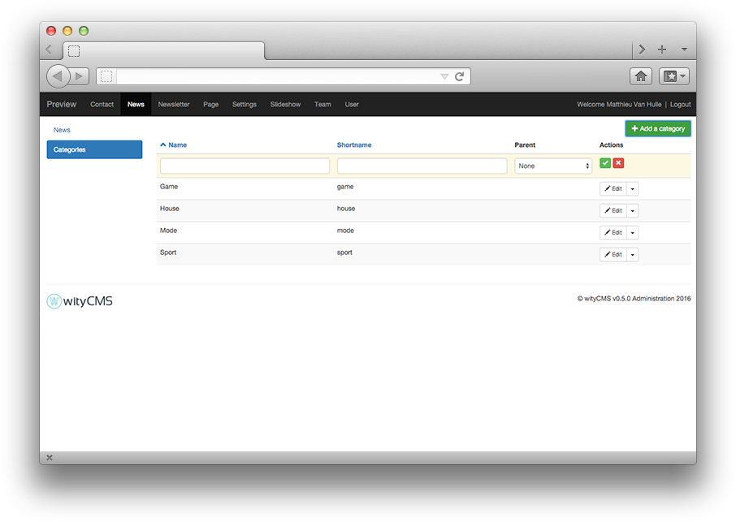
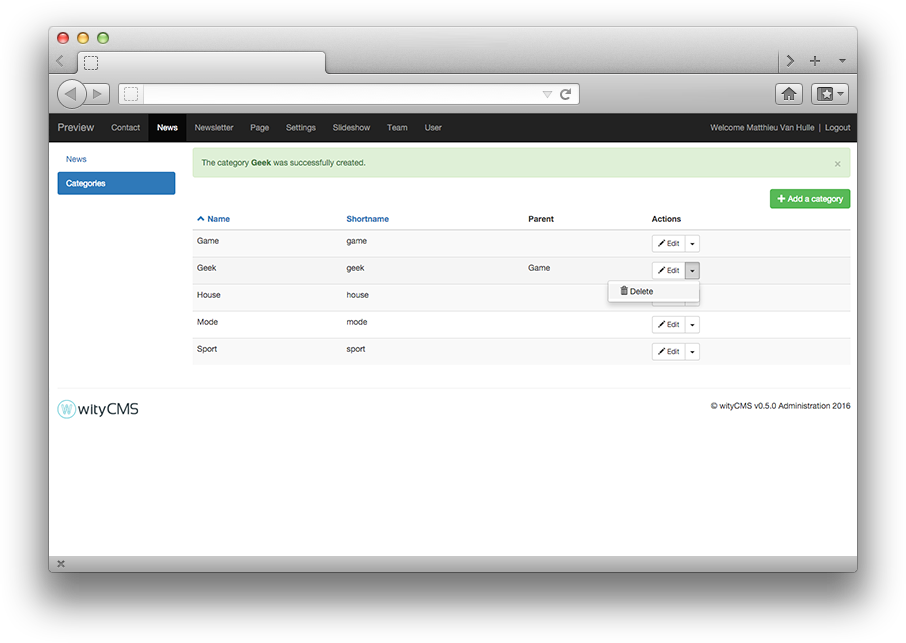

# News

To differentiate the two application "**News**" to "**Pages**", let's just say that application news has only one CMS page with multiple news after each other (like a blog).

"**News**" offers a dynamic side that does not have the "**Pages**". Moreover, the information is not sustainable on the screen, a new item is automatically placed above the last, shifting the presentation of your page. "**News**" are slightly more complex hierarchy that pages.

"**News**" appliclation follows the rules of publication: date of publication, text modification etc.

Using "**News**" application is interesting to create and manage your site's news, key announcements etc. If you think you create an "*RSS feed*", these is the application that will be used. Interesting for those who want to subscribe to the latest news from your website for example. 

"**News**" application will allows you to add single news to your website from the back-end to front-end with an advanced text editor ([CKEditor](http://docs.ckeditor.com/)).

## List

The list contains all the news created on your website. It gives you a rapid view of: 

* The title 
* Author
* Category it belongs
* State of publication
* The number of views
* The last modification date

## Create and edit news

The rapid action button "**Edit**" permit you to edit or delete the current news. 
If you want to add a news: Click on green button **"Add a news"**.

### Editing:

After clicking the button "Add a news" in the upper right of the back-office. You can write a news.


* **Title***: Start by indicating the title of your news *(it must not exceed 140 chars)*.
* **URL***: The URL will be automatically generated URL with the information you fill in the title form. You can if you want change this URL.
* **Content**: Thanks to **[CKEditor](http://docs.ckeditor.com/)** you are able to write, layout your news and add some pictures and videos as desired.

### Details:

On the side, you find the details information about your current news:

* **Published**: yes / no (this allow you to write a news without to publish it on your website).
* **Date of publication***: it is automatically filled when you publishing your news. Moreover, you can edit yourself the date of publication as desired.
*  **Hour of publication***: it is automatically filled when you publishing your news. Moreover, you can edit yourself the time of publication as desired.
* **Author**: by default the author is the name of the account with which you are log in. Moreover, you can edit yourself the author as desired.
* **Image**: You can upload a main image for your news (use like header / news preview etc., that depends of your template).

### Categories:

Categories permit to classify your news according to their content. This part is explain lower.  

### SEO:

Meta tags, Title and Link are "**html**" tag inserted in the ```<head >``` section of a web page (before the ```<body>```. 

They help to provide "*guide*" for the search engines, social networks and other systems using "*metadata*". The information in these tags are not visible on your website, but appear in the source code of the page.

* **Meta title**: by default is the name of your news
* ** Meta description**:

### Submit your news:

* **Submit**:
* **Cancel**:

## Categories

You can have lot of news and subjects totally different. This is why, wityCMS offers the ability to classify your news in different categories according to their content.

This list contains all the categories and gives you the name, shortname and the parent page (if it is specify).


You must click on the green button "**Add a category**" to create a new category.



* **Name**: fill with the name of your category (e.g: Geek)
* **Shortname**: specify a "shortname" if you want (e.g: geek)
* **Parent**: specify if it is a sub category (e.g: Game)
* **Actions**: *create* or *abandon*

A notification inform you "the category **Geek** was successfully created".

You can also delete a category when you want with the action button "**Delete**". 

To confirm deletion, a pop-up appear asking you: "Do you really want to delete this category?".
If you are certain, click on "**Delete**" if not click on "**Cancel**".

A notification appear to inform that the category is successfully deleted.
