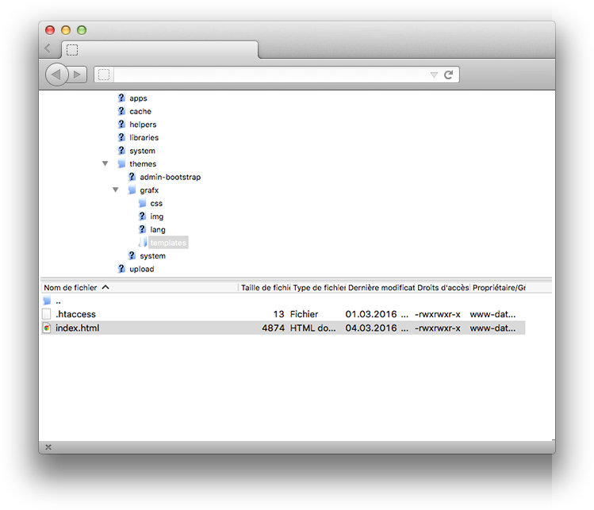

# Pages

This is the essential application of wityCMS. If you want to make a website with a lot of pages, the application ***Pages*** is the solution. Each page created in this application is a full web page.

## Pages listing

The list contains all the pages created on your website. It gives you a rapid view of: 

* Title
* Author
* Views
* Date of the last modification 


The action button **Edit** allows you to *edit* or *delete* a page (according to permissions granted by your administrator).


## Create or edit page

If you want to add a page: Click on green button **Add a page**.

### Editing

After clicking the button **Add a page**. You can write a new page.


* **Title***: Start by indicating the title of your page (less is better).
* **URL***: The URL will be automatically generated with the information you fill in the title form. If you want, you can change this URL.
* **Content**: Thanks to **[CKEditor](http://docs.ckeditor.com/)** you are able to write, layout your news and add some pictures and videos as desired.

### Details

On the side, you find the details information about your current page:

* **Author**: by default the author is the name of the account with which you are log in. Moreover, you can change the author.
* **Subtitle**: used for *SEO*.
* **Image**: You can upload a main image for your page (use like header / page preview etc., that depends of your template).

### SEO

The "Title" and "Description" meta tags are **`html`** tags inserted in the `<head>` section of a web page (before the `<body>`). 

They help you to provide information for the search engines, social networks and other systems using "*metadata*". The information on those tags are not visible on your website, but it appears in the source code of the page.

* **Meta title**: by default it is the page title
* **Meta description**: Input a short description of your page (optional). 125 characters maximum

### Post your page

To finalize the edition of your page, click on the **Submit** button. 

## Index your page

To index your page in the *navbar* (navigation bar / menu), you need to open your FTP client (e.g: [FileZilla](https://filezilla-project.org)). 

Open the folder containing website sources:

1. **Themes** folder
2. Name of your theme (here **grafx**) 
3. **Templates**
4. Download the **index.html** 


5. Open it with a text editor (e.g: [**Sublime Text**](https://www.sublimetext.com/))
6. Add your page as you can see below between `<li>` and `</li>` 
```html
<ul class="nav navbar-nav">
    <li><a href="/"><span>{lang Home}</span><br />
        <em>{lang starting page}</em></a></li>
    <li><a href="/about"><span>{lang About}</span><br />
        <em>{lang the company}</em></a></li>
    <li><a href="/services"><span>{lang Services}</span><br />
        <em>{lang our skills}</em></a></li>
    <li><a href="/portfolio"><span>{lang Portfolio}</span><br />
        <em>{lang our works}</em></a></li>
    <li><a href="/news"><span>{lang Blog}</span><br />
        <em>{lang latest posts}</em></a></li>
    <li><a href="/contact"><span>{lang Contact}</span><br />
        <em>{lang send us an email}</em></a></li>
</ul>
```

7. Save and upload the index.html file to replace it.