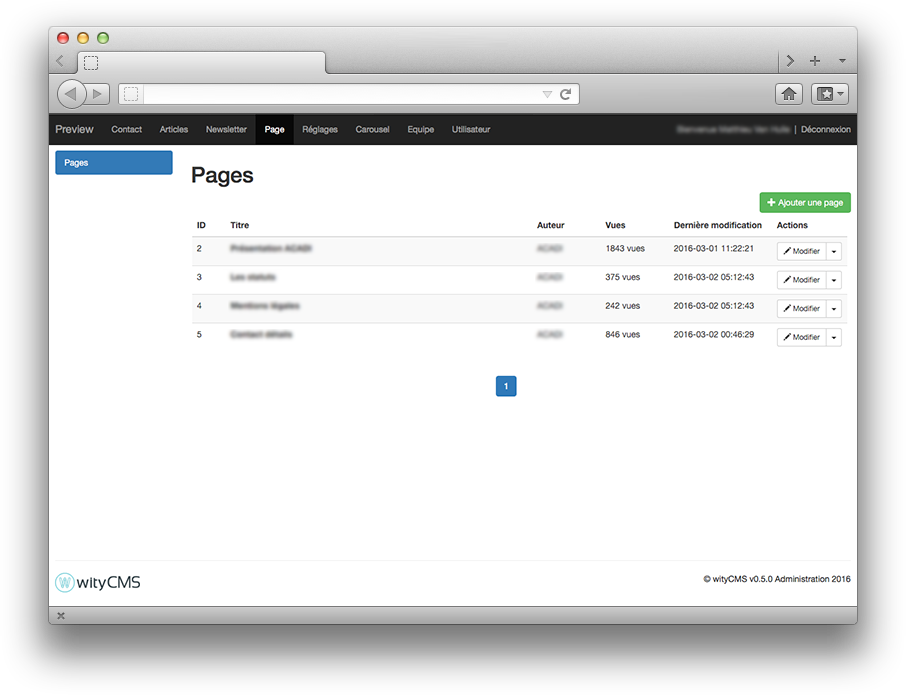
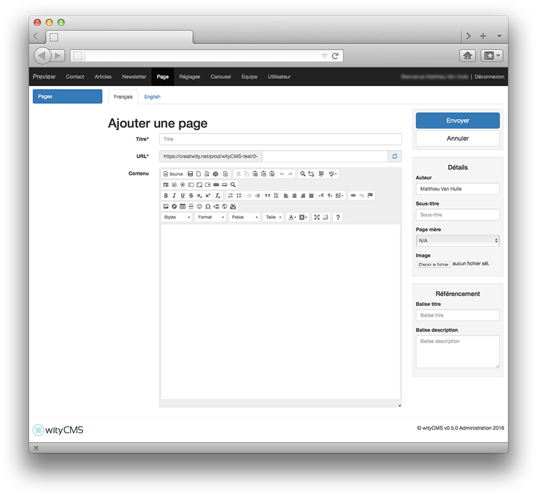

# Pages

This is the essential type of content in wityCMS. If you want to make a website, the pages are here for. To focus minds, a page in wityCMS is the base of your website. Each page created for the admin interface is actually a web page. This page is static and a link is automatically inserted into your menu or sub-menu.

## Pages list

This list contains all created pages and gives you their name as it appears in the menu of your Website, the author of the page, if the page is active (displayed) or not, creation date, and the number of person who views this page. And an action button allows you to edit or delete its contents (according to permissions granted by your administrator).

In the top left of this list, a tab to create a new page. Click on "Add a page".

## Create or edit your page

When you click in “adding a page”, a form appears on the screen, this is where you can create your new page and its details.

### Editing:

After clicking the button "Add a page" in the upper right of the wityCMS admin. You arrive on creating page of your page.

* **Title***: Start by indicating the title of your page (less is better).
* **URL**: you will be automatically generated URL in relation to the title you have just entered. You can if you want change this URL.
* **Content**: This is where it all happens. Thanks to **[CKEditor](http://docs.ckeditor.com/)** you will be able to write, layout your page and add pictures/videos as desired.

### Details:

On the side you will find the schedule information in your article:

* **Publication time***: it’s automatically filled when you creating your article. However, you can edit yourself the time of the publication as desired.
* **Author**: you can mention the author of the article; the default author name is the name of default account with which you are connected.
* **root page**: 
* **Image**: The image field is used to select the picture of your page (using like header etc.)

### Referencing:

* **Tag title**:
* **Tag description**:

### Validate your page:

* **Submit**:
* **Cancel**:

## Index your page

To index your page correctly on your site you need: 
