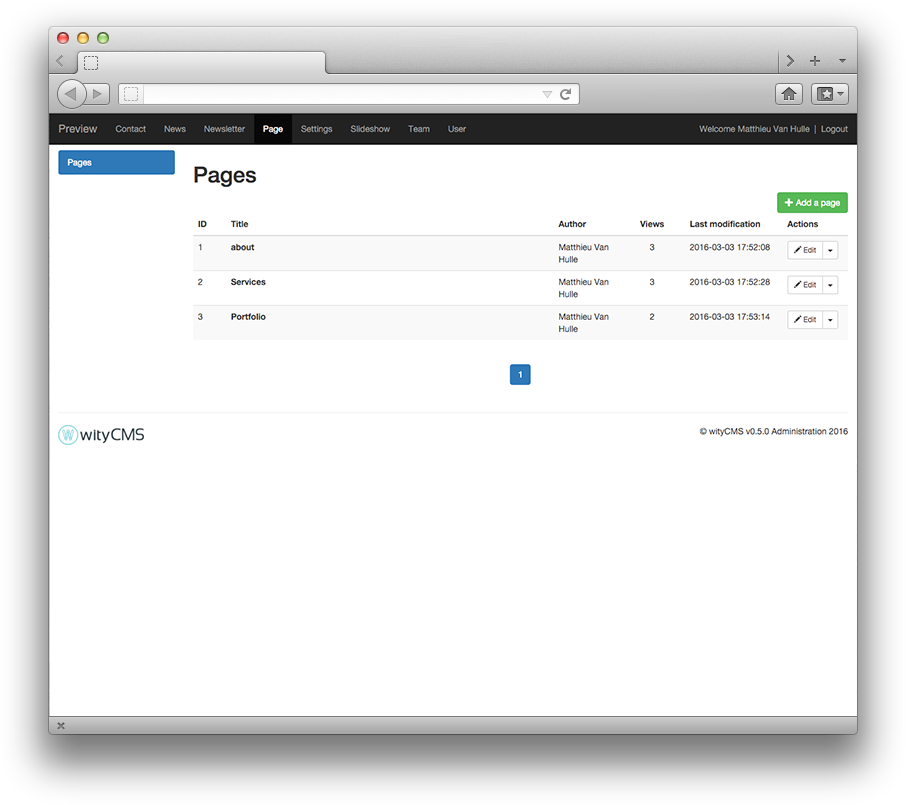
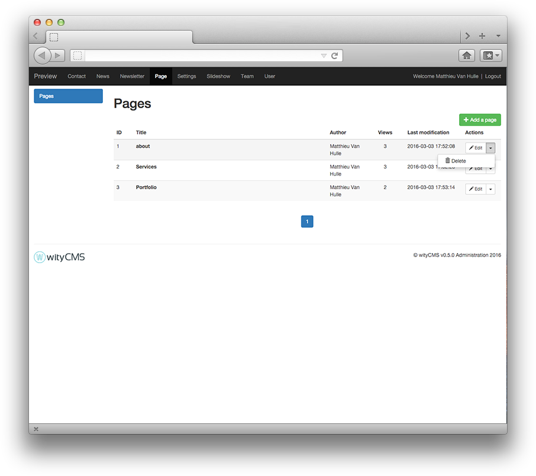
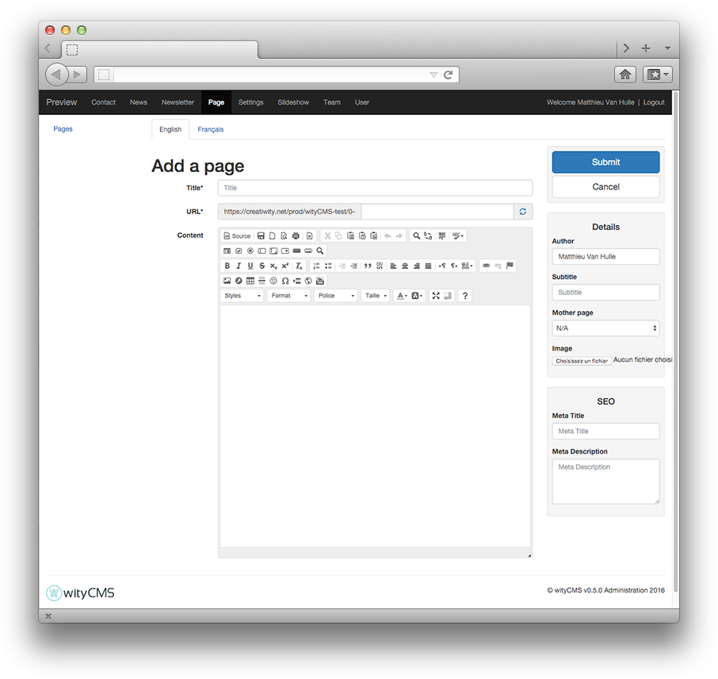

# Pages

This is the essential type of content in wityCMS. If you want to make a website, the pages are here for. To focus minds, a page in wityCMS is the base of your website. Each page created for the admin interface is actually a web page. This page is static and a link is automatically insert into your menu or sub-menu.

## Pages list

This list contains all created pages and gives you their "title" as it appears in the menu of your Website, the "author" of the page, the number of person who "views" this page and the date last modification. 


The action button allows you to edit or delete its contents (according to permissions granted by your administrator).

## Create or edit your page

After you click at the green button "**Add a page**" in the upper right of the wityCMS admin. You arrive on Add a page, this is where you can create your new page and its details.

### Editing:



* **Title***: Start by indicating the title of your page (less is better).
* **URL***: you will be automatically generated URL in relation to the title you have just entered. You can if you want change this URL.
* **Content**: This is where it all happens. Thanks to **[CKEditor](http://docs.ckeditor.com/)** you will be able to write, layout your page and add pictures/videos as desired.

### Details:

On the side you will find the information in your page:

* **Author**: you can mention the author of the page; the default author used, is the name of default account with which you are connected.
* **Subtitle**: 
* **Mother page**: If you want to link a page to an other like a subpage. You can attribute a mother page.
* **Image**: You can load a main image for your page (using like header / news preview etc. That depend of the used template).

### SEO:

Meta tags, Title and Link are html tag inserted in the ```<head >``` section of a web page (before the ```<body>``` ). They help provide guide to the search engines , social networks and other systems to categorize the news content using metadata. The information in these tags are not visible on the screen, but appear in the source code of the page.

* **Meta title**: By default the title of your page will be increment here.
* ** Meta description**:

### Submit your page:

* **Submit**:
* **Cancel**:

## Index your page

To index your page correctly on your website you need to open FileZila and connect you to your FTP. 


