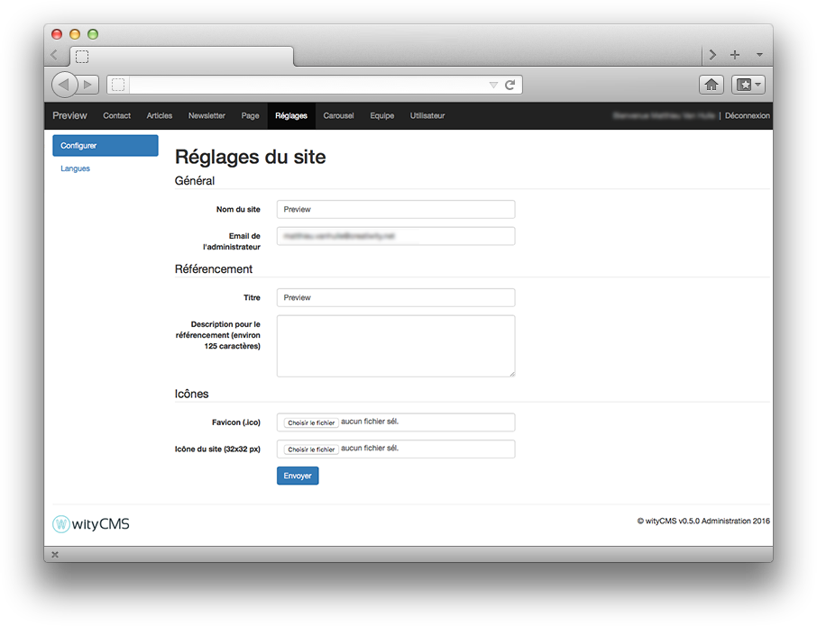
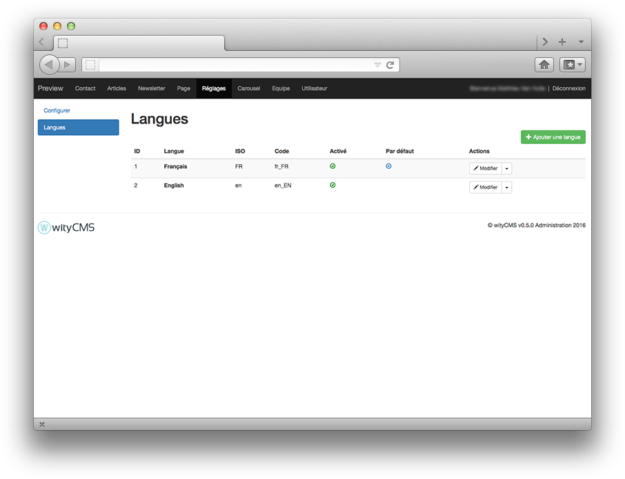
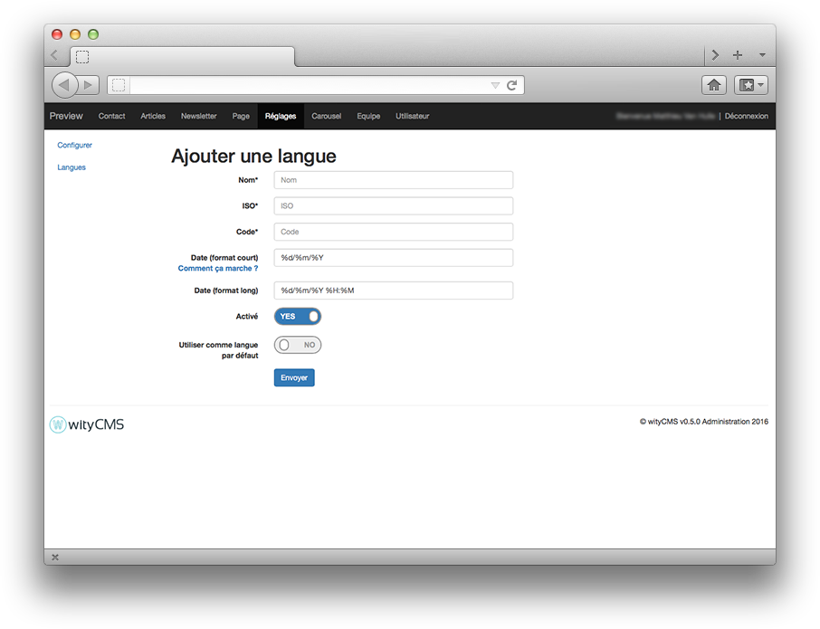

# Settings

We will present the official application developed by wityCMS team and offered as Open Source. It is possible that news applications are provided and developed by the other developer community.

Settings application will allow you to configure the general elements of your website. You will find the items you have filled during the installation of wityCMS.

## Configuration

General it’s the first configuration you done during the installation steps. 
* **Site name**: just give a name at your website who define your activity
* **Administrator Email**: generally, it is better to give the address of the webmaster in charge of the website.

SEO section allows you to edit the elements that will be used when site appears in different Google searches. You can leave blank the fields below, but it is strongly advised to complete them correctly if you want to appear clearly on Google results.

* **Site Title**: Title who define your activity
* **Description for SEO**: a short description of your activity (less than 125 chars).

It is also in this section of the website you can edit the icon that will identify your website. More often is the brand logo of your company or something represent the content of your website.

* **favicon (.ico)**: The favicon used in the address bar, bookmarks, tabs, or other shortcuts.
* **Site Icon (32x32 px)**:

## Languages

As you indicated earlier, wityCMS is software for multilingual content editing. You have the opportunity here to tell the system the new language added that will automatically update the other modules of the site.

By default, the site will contain the language specified during installation. But you can click the button to add a language to start the configuration.

## Add a language

To add the language you will need to carefully fill the fields indicated in ensuring respect although you ISO 639 (standard list of languages), ISO 3166 size (standard list of countries) - http://www.localeplanet.com/icu/.

* **Name***:  Name
* **Iso***: Iso
* **Code***: Code
* **Date** (short format): %d%m%Y
* **Date** (long format): %d/%m/%Y %H:%M
* **Activated**: Yes / No
* **Use by default**: Yes / No

