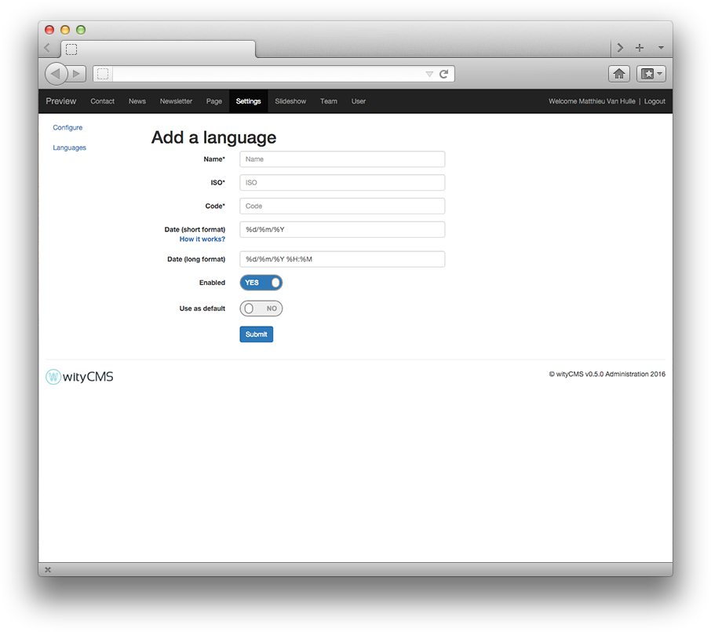

# Settings

The "**Settings**" application will allow you to configure general settings of your website.

## Settings of the site

### General

*General* - it is the first configuration you did during the installation steps.

* **Website's name**: it is the name you need to give at your website to define your activity.
* **Administrator's Email**: more often, it is better to give the address of the webmaster in charge of the website.

### SEO

This section allows you to edit the elements that will affect the visibility of your website or a web page in search engines (when the website appears in different Google searches). You can leave the fields below blank. But if you want to be found efficiently on search engines, it is strongly recommended to complete the fields correctly.

* **Title**: Website title who define your activity
* **Description (about 125 symbols)**: a short description of your activity (it cannot exceed 125 characters).

### Icons

You can edit the icon that will identify your website. More often, it is the logo of your company or a graphic that represents the activity of your website.

* **favicon (.ico)**: The favicon used in the address bar, bookmarks, tabs, or other shortcuts.
* **Site's Icon (32x32 px)**:

When you finish, you just need to "**submit**" and your modification will be saved. 

## Languages

wityCMS is software for multilingual content editing. 
In this section,you can add new languages and define which is the default language.

Click on the button "**Add a language**" to start the configuration of a new language.

## Add a language

Respect the [ISO 639 and ISO 3166](http://www.localeplanet.com/icu/) to configure your new language.

* **Name***:  Name
* **Iso***: Iso
* **Code***: Code
* **Date** (short format): %d%m%Y
* **Date** (long format): %d/%m/%Y %H:%M
* **Enabled**: Yes / No
* **Use as default**: Yes / No

To confirm you new language click on the button "**submit**".
Now, you can translate all your content in the language you just add.