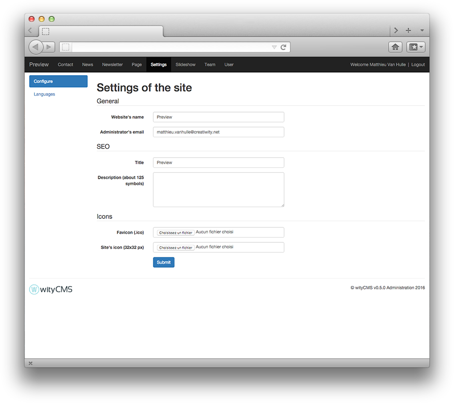

# Settings

"**Settings**" application will allow you to configure the general settings of your website.

## Settings of the site

### General

*General* - it is the first configuration you done previously during the installation steps.

* **Website's name**: just give a name at your website who define your activity.
* **Administrator's Email**: more often, it is better to give the address of the webmaster in charge of the website.

### SEO

This section allows edit the elements that will affect the visibility of a website or a web page in a search engine's, when site appears in different Google searches. You can leave blank the fields below, but it is strongly advised to complete them correctly if you want to appear clearly on results.

* **Title**: Website title who define your activity
* **Description (about 125 symbols)**: a short description of your activity (don't exceed 125 chars).

### Icons

It is also in this section of the website you can edit the icon that will identify your website. More often is the brand logo of your company or something represent the content of your website.

* **favicon (.ico)**: The favicon used in the address bar, bookmarks, tabs, or other shortcuts.
* **Site's Icon (32x32 px)**:

When you finish, you just need to "**submit**" and your modification will be saved. 
## Languages

As you indicated earlier, wityCMS is software for multilingual content editing. You have the opportunity here to tell the system the new language added that will automatically update the other modules of the site.

By default, the site will contain the language specified during installation. But you can click the button to "**Add a language**" to start the configuration.

## Add a language

To add a new language you will need to carefully fill the forms indicated in ensuring respect although you ISO 639 (standard list of languages), ISO 3166 size (standard list of countries) - [local planet](http://www.localeplanet.com/icu/).

* **Name***:  Name
* **Iso***: Iso
* **Code***: Code
* **Date** (short format): %d%m%Y
* **Date** (long format): %d/%m/%Y %H:%M
* **Enabled**: Yes / No
* **Use as default**: Yes / No

When you finish, you just need to "**submit**" and your modification will be saved.