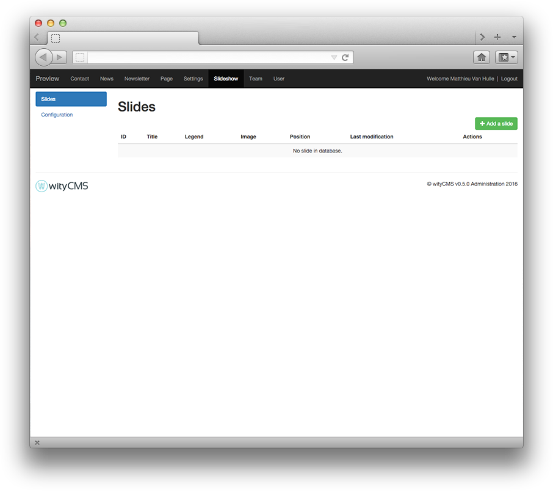
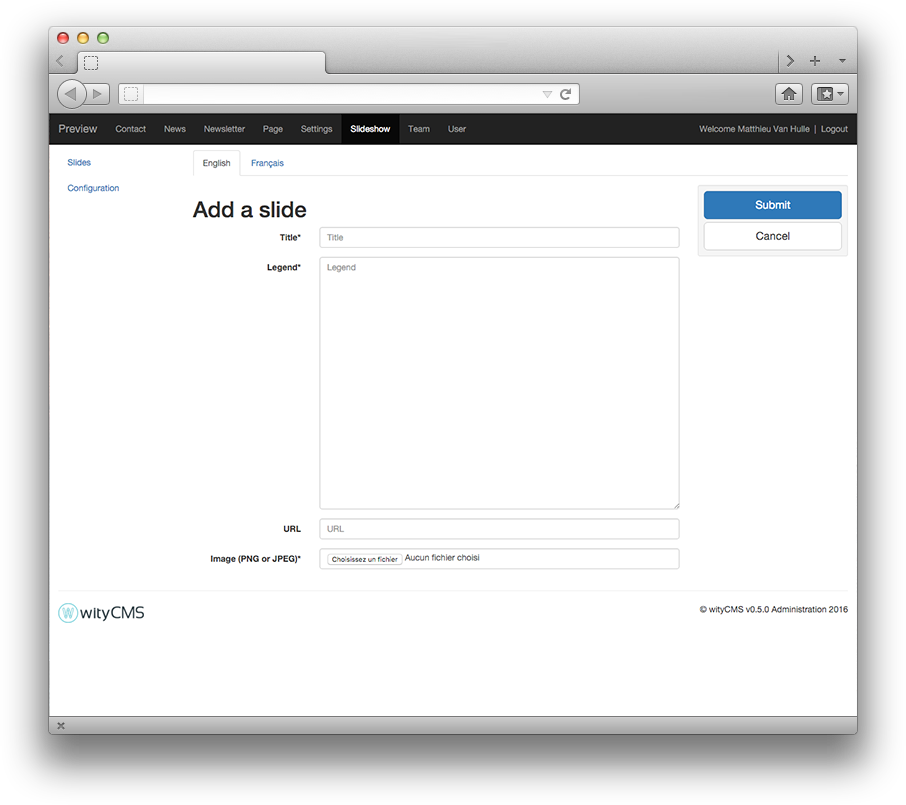

# Slideshow

The Slideshow application will allow you to manage the slider on your website:

## Slides lists

This list contains all created slides and gives you their title as it appears on your website, the legend, the associated image, position, date of the last modification, and an action button allows you to change or delete its contents (according to permissions granted by your administrator).

In the top left of this list, a tab prompts you to create a new slide. 
Click on "**Add a slide**".

## Add a slide

When you click on “**Add a slide**”, you are redirected to a new page, here is where you can create your new slide.

* **Title***:
* **Legend**:
* **URL**:
* **Image** (PNG or JPEG)*:

## Configuration

The configuration tab at the top left of the admin wityCMS, allows you to configure your slider. You can automatic playback, configure pause time and the transition time.

* **Enable slides autoplaying**:
* **Pause time between two slides (ms)**:
* **Transition time between two slides (ms)**:
