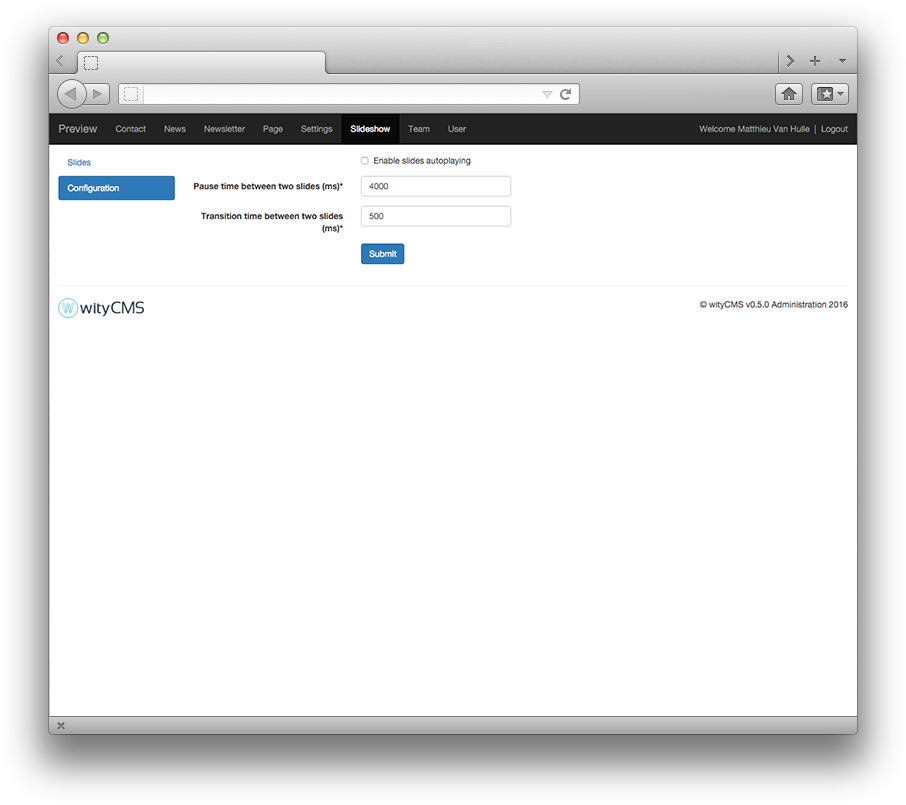

# Slideshow

The "**Slideshow**" application will allow you manage the slider on your website.

## Slides lists

The list contains all the slides created on your website. It gives you a rapid view of: 

* Title
* Legend
* Image
* Position
* Last modification

In the top left of this list, a tab prompts you to create a new slide. 
Click on "**Add a slide**".

## Add a slide

When you click on “**Add a slide**”, you are redirected to a new page, here is where you can create your new slide.

* **Title***:
* **Legend**:
* **URL**:
* **Image** (PNG or JPEG)*:

## Configuration

The configuration tab at the top left of the admin wityCMS, allows you to configure your slider. You can automatic playback, configure pause time and the transition time.

* **Enable slides autoplaying**: If you want to make you website more dynamic, you can enable the slides autoplaying. 

When you decide to enable slides autoplaying you can edit this two parameter : 

* **Pause time between two slides (ms)**: the default value is 4000
* **Transition time between two slides (ms)**: the default value is 500