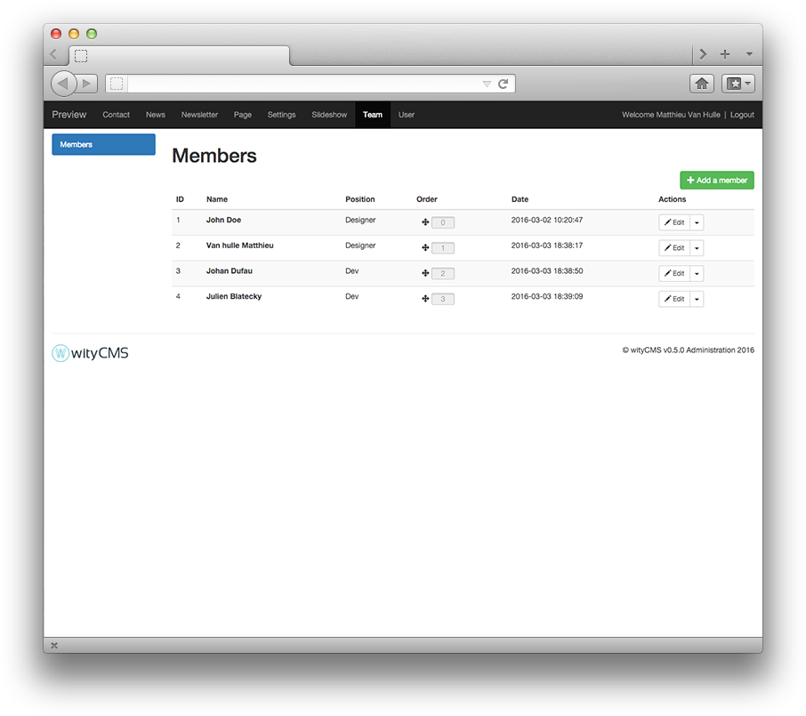

# Teams

Team application offers the possibility to create some profiles with personal information about your team. 

## List

This list contains all members created on your website. This list gives you their Name as it appears on your website, the position, the order (you can manage it), date of creation, and an action button allows you to change or delete its contents (according to permissions granted by your administrator).

### Order

By default the members of your team are ordered with the ID. But if you want you can easly reorder it ...

## Add a member

When you click on “**Add a member**”, you are redirect to a new page, here is where you can create your new member profil.

* **Name**: More often this form is fill with the First Name and the last name
* **Position**: Fill with the member position in your organization
* **Description**:This field is actually not use in the front page. It's just here for the SEO.
* **Email**: member email's
* **LinkedIn**: LinkedIn member page
* **Twitter**: Twitter member page
* **Image**: First image you see in the front page
* **Hovering Image**: Image you see when the moose is hovering the image.
 

 
