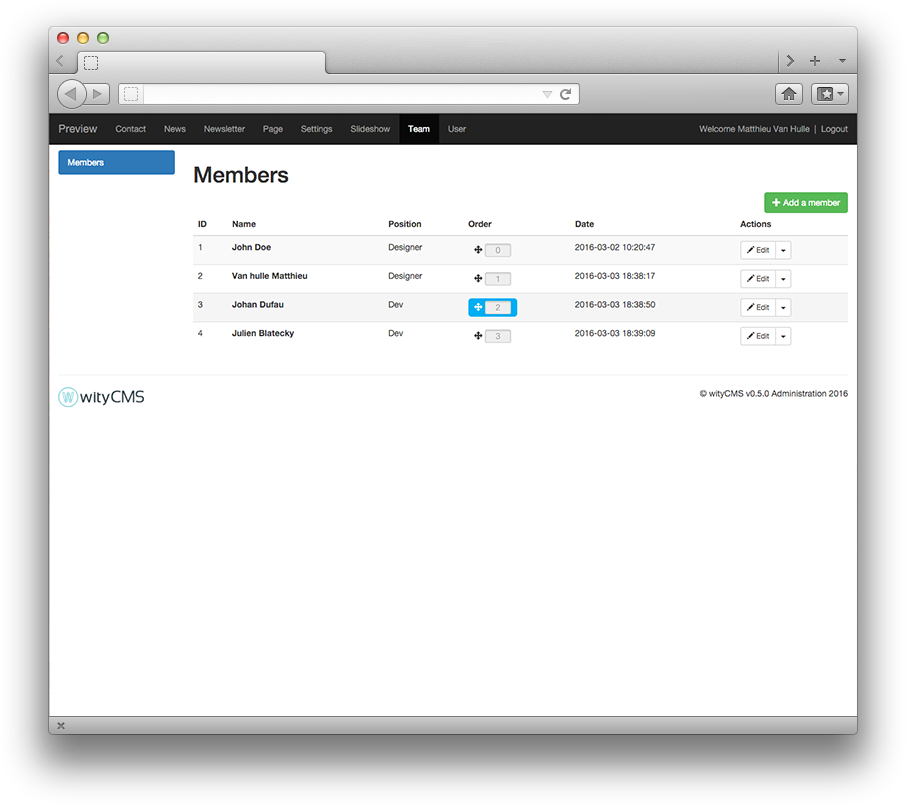

# Teams

Team application offers the possibility to create some profiles with personal information about your team. 

## List

This list contains all members created on your website. This list gives you their Name as it appears on your website, the position, the order (you can manage it), date of creation, and an action button allows you to change or delete its contents (according to permissions granted by your administrator).

### Order

By default the members of your team are ordered with the ID. But if you want you can easly reorder it ...

## Add and edit member

You can add new profile member easily to create your team.

* **Name**:
* **Position**:
* **Description**:
* **Email**:
* **LinkedIn**:
* **Twitter**:
* **Main picture**:
* **Hover picture**:
 

 
