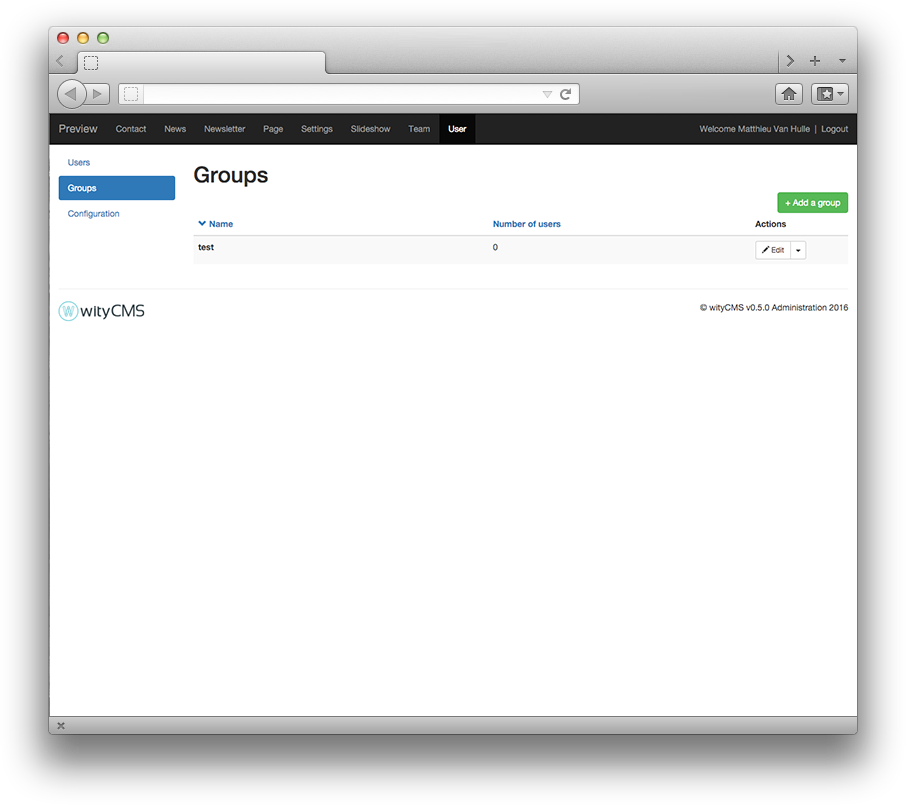
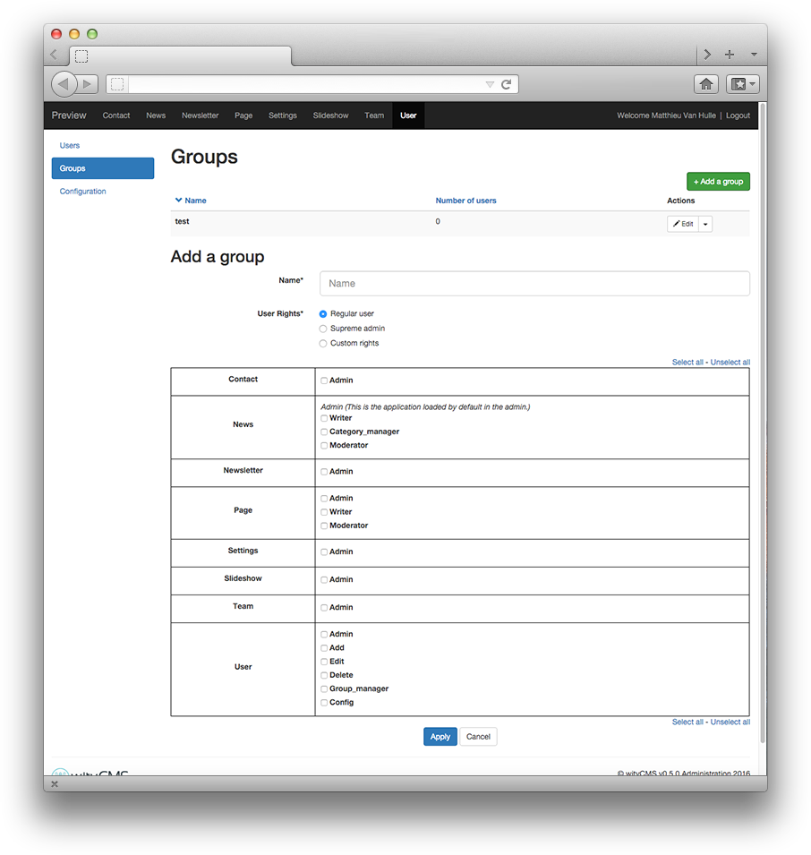

# User

The "**Users**" application provides the ability to manage account for each person who register to the website (according to permissions granted by your administrator).

## User listing

This list contains all registered users. It gives you a rapid view of: 

* **ID**
* **Nickname**: use to log in 
* **Group**: it belongs
* **Last connection**

The action button "**Edit**" allow you to *edit* or *delete* a user (according to permissions granted by your administrator).

The bloc search at the right allows you to make a fast search when you need to find a user.

## Add a user

Click on the “**Add a user**” button,to create a new user. By default the inscription are free for any person who come to visit your website.

*  **Nickname**
*  **Password** 
*  **Password (confirmation)**
*  **Email***
*  **First name**
*  **Last name**
*  **Group**
*  **User Rights**: Regular user / Supreme Admin / Custom rights access

### Right access table

For each app, you can select or deselect an access right to define a particular permissions for the user.

* **Contact**: Admin 
* **News**: Writer / Category_manager / Moderator
* **Newsletter**: Admin
* **Page**: Admin / Writer / Moderator
* **Settings**: Admin
* **Slideshow**: Admin
* **Team**: Admin
* **User**: Admin / Add / Edit / Delete / Group_manager / Config

## Groups

User application allows you to create groups to define specific permission to assign user right.

## Configuration

Define the rule of user registration. 

* **Enable user account validation by an admin**: user account is not automatic, an admin need to validate account one by one before to validate. 
* **At registration, send email to confirm the email address**: an email is automatically send to confirm the email address before creating an account. 
* **Keep deleted and refused accounts in the database disabling them**: the database keep in memory all account created even whose deleted.
* **Open registration**: people who are on the website can create an account.
* **Send a user account summary by mail**: give a repository subscription to the user who just create an account. 

