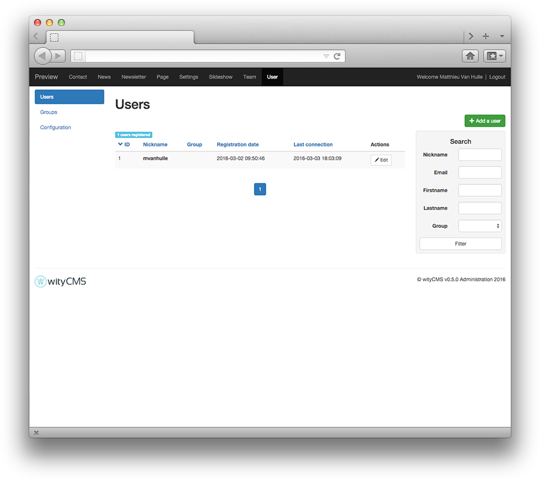

# Users

The "**Users**" application provides the ability to manage account for each person who register to the website (according to permissions granted by your administrator).

## Users List

This list contains all registered users. It gives you a rapid view of: 

* **ID**
* **Nickname**: use to log in 
* **Group**: it belongs
* **Last connection**

At the right you have "**Search**" application who permit you to make a fast search when you need to find a user. 

## Add a user

To create a new user, click on the "**add user**" button. A new form appears on the screen, this is where you can create your new user and edit his profile.

*  **Nickname**: 
*  **Password**: 
*  **Password (confirmation)**:
*  **Email***:
*  **First name**:
*  **last name**:
*  **Group**:
*  **User Rights**: Regular user / Supreme Admin / Custom rights access

### Right access table

You can select and deselect all what is exactly the same things to attribute right like "Suprem Admin or Simple User".

* **Contact**: Admin 
* **News**: Writer / Category_manager / Moderator
* **Newsletter**: Admin
* **Page**: Admin / Writer / Moderator
* **Settings**: Admin
* **Slideshow**: Admin
* **Team**: Admin
* **User**: Admin / Add / Edit / Delete / Group_manager / Config

## Group of users

User membership in groups: Allows you to assign users to groups.
You can see the number of users assign to the groups.

### Add a new group

Allows you to add new groups of users to attach it to switch to the rights management. By default, there are two right groups: Administrator and non-Administrator.

## Configuration

Setting permissions and group access levels:

* **Enable user account validation by an admin:**
* **At registration, send email to confirm the email address:**
* **Keep deleted and refused accounts in the database disabling them:** 
* **Open registration:**
* **Send a user account summary by mail:**

